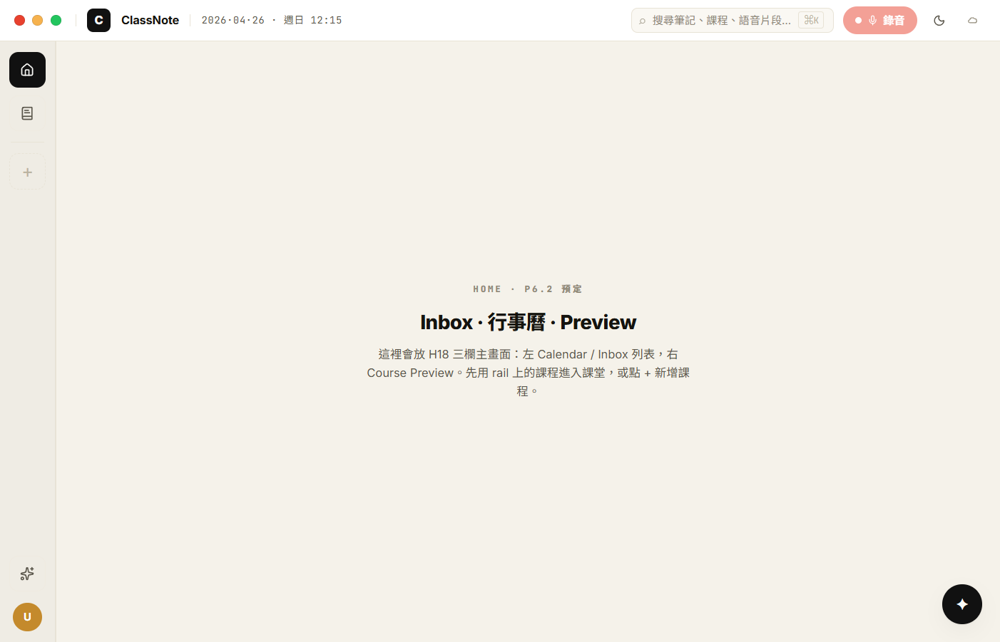
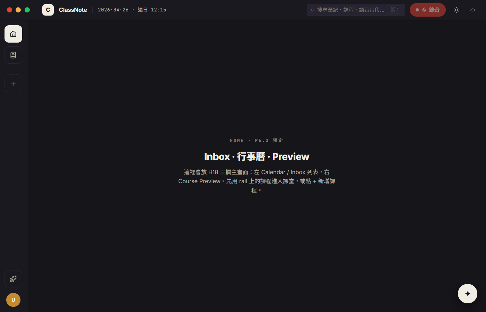
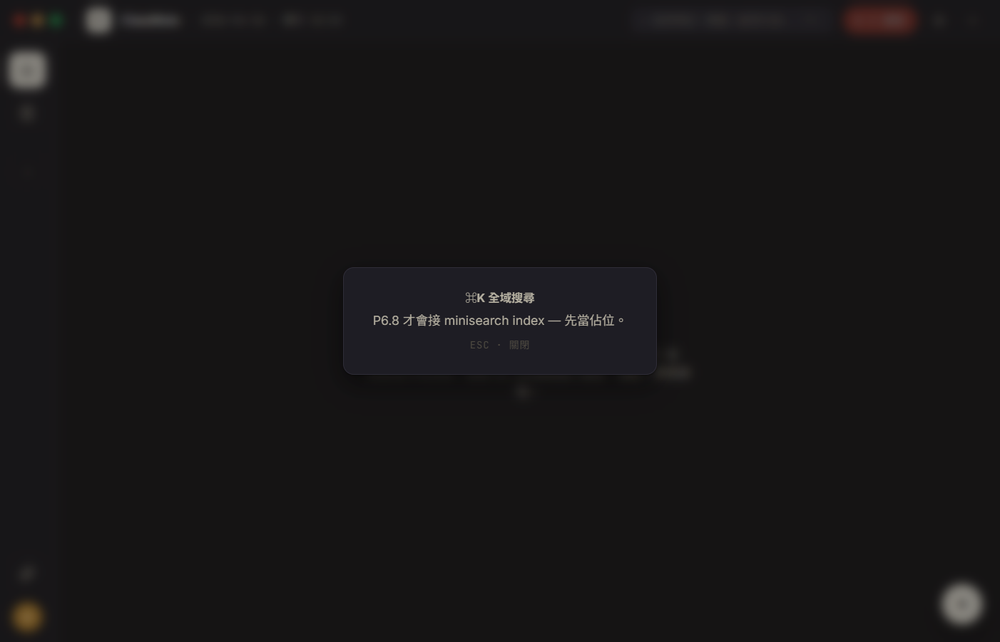
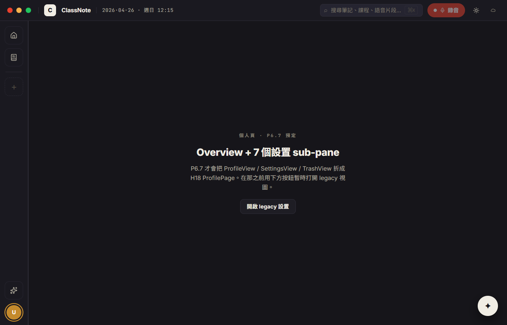
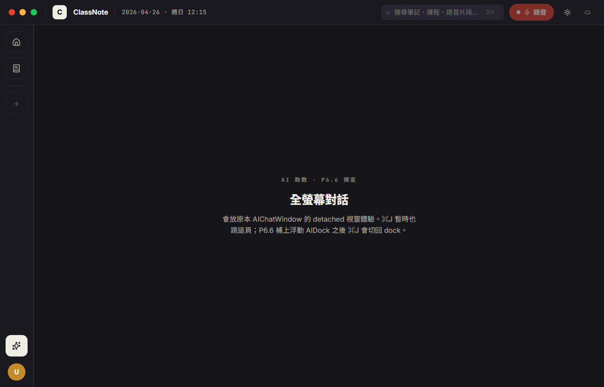
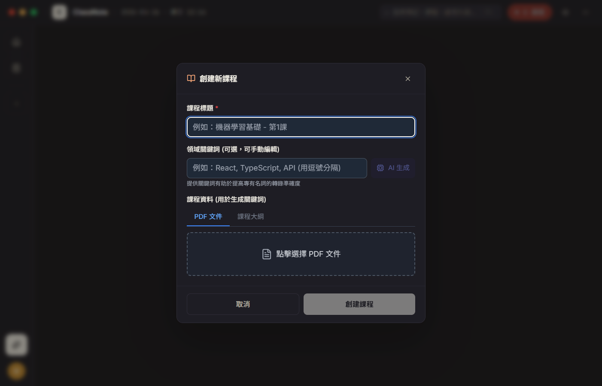

# CP-6.1 · Phase 6 真重寫 — Chrome shell 上線

**狀態**：等你 visual review。
**規則**：Phase 6 master plan 已 lock 三條（UI 1:1 / 後端 wire / 沒做的留白）。本 CP 只動 chrome（TopBar + Rail + 路由 shell），各 nav target 還沒重寫的部分先 fallback 到 legacy view，等 P6.2 ~ P6.7 一片片換。
**驗證**：`tsc --noEmit` clean、`npm run dev:ephemeral` 起來、CDP 截圖 6 張比對 prototype 視覺意圖。
**Plan 對應**：`PHASE-6-PLAN.md` § 4 P6.1。

**分支**：`feat/h18-design-snapshot`

## P6.1 commits

```
docs(h18): Phase 6 master plan — 真重寫，不再 token swap   [2970a13, 已上]
                  ↑ CP-6.1 開始的起點，這次接續推
                                                          ↓
feat(h18-cp61): H18 nav state machine + courseColor utils
feat(h18-cp61): H18Rail · 62px vertical icon rail
feat(h18-cp61): H18TopBar · traffic lights + ⌘K + 錄音 + 主題 + TaskIndicator
feat(h18-cp61): H18DeepApp shell + App.tsx mount + tauri decorations:false
docs(h18): CP-6.1 walkthrough + screenshots
```

（這次仍合進一個 commit 推上來，commit message 走 `feat(h18-cp61): chrome shell — TopBar + Rail + Router state machine`。）

## 啟動

```bash
cd d:/ClassNoteAI-design/ClassNoteAI
npm run dev:ephemeral
```

開出來會看到視窗**沒有 Windows native title bar** — 因為 `tauri.conf.json` 已 flip `decorations: false`，改用我們自畫的紅黃綠 traffic lights（H18 prototype 設計風格）。

## 視覺驗證 — 6 張 CDP 截圖

> 截圖在 `docs/design/h18-deep/checkpoints/screenshots/`，CDP 直接抓 WebView2 viewport（1402×892 ish）。

### 1 · cp-6.1-light-home.png — 第一眼，light mode



對應 `h18-app.jsx` L334-419 + `h18-parts.jsx` L52-103 (TopBar) + L106-161 (Rail)。

- [ ] **Chrome 暖底色** — 整片是 `#f6f1e7` 系暖灰，不再 Windows 灰白
- [ ] **Top 左**：紅 / 黃 / 綠 traffic lights 三顆（CP-1 已就緒的 `WindowControls` 元件），| divider，logo `C` 暖深圓角方塊，brand `ClassNote`，| divider，datetime mono `2026·04·26 · 週日 12:15`
- [ ] **Top 右**：⌕ 搜尋筆記、課程、語音片段… ⌘K · 錄音紅膠囊（disabled 因為沒選課程）· Moon icon 切主題 · TaskIndicator
- [ ] **Rail (62px)**：⌂ 首頁（active 反白）/ ▤ 知識庫 / divider / （課程 chip 區，新使用者沒課所以空）/ + dashed border / spacer / ✦ AI 助教 / 👤 avatar `U` 金色圓
- [ ] **Main**：HOME · P6.2 預定 eyebrow + Inbox · 行事曆 · Preview 標題 + 留白 hint
- [ ] **AI fab**：右下 44px 圓 ✦ 黑底（dark invert ink），hover lift -2px

### 2 · cp-6.1-dark-home.png — ⌘\ 切暗



- [ ] 大底由暖米換成 `#16151a` 暖近黑
- [ ] Rail 反過來，home active 變暖白方塊
- [ ] Recording button 在 dark 也是同一顆 `#e8412e` 紅（dot + mic）
- [ ] 主題 icon 切回 Sun
- [ ] **rail course chip 區依舊空**（沒課），這對得上設計稿的空狀態

### 3 · cp-6.1-search-stub.png — ⌘K 全域搜尋占位



- [ ] 0.45 黑紗 + backdrop blur 6px
- [ ] 中央卡片：⌘K 全域搜尋 / "P6.8 才會接 minisearch index — 先當佔位。" / ESC · 關閉
- [ ] ESC 關得掉，點 backdrop 也關得掉（onClick stopPropagation 在卡片上）

> 真做：P6.8 把 minisearch index + SearchOverlay 一起補上，這個 stub 才會被換掉。

### 4 · cp-6.1-profile-placeholder.png — 👤 進個人頁



- [ ] eyebrow `個人頁 · P6.7 預定`
- [ ] title `Overview + 7 個設置 sub-pane`
- [ ] hint：解釋 P6.7 才會把 ProfileView / SettingsView / TrashView 折成 H18 ProfilePage
- [ ] **`開啟 legacy 設置` 按鈕** — P6.7 之前還是要能改 whisper / 翻譯 / 音訊裝置，所以暫時保留入口

### 5 · cp-6.1-ai-placeholder.png — ✦ AI 助教全螢幕



- [ ] eyebrow `AI 助教 · P6.6 預定`
- [ ] title `全螢幕對話`
- [ ] hint：⌘J 暫時也跳這頁；P6.6 補上浮動 AIDock 之後 ⌘J 會切回 dock
- [ ] **AI fab 自動消失**（已經在 ai page 不需要再顯示）

### 6 · cp-6.1-add-dialog.png — + 新增課程



- [ ] 點 rail 的 + → 開現有 `CourseCreationDialog`（legacy，下一個 CP 才換 H18）
- [ ] backdrop blur 看得到 chrome
- [ ] dialog 本體還是 legacy 樣式，**這是預期的** — P6.3 才換成 `AddCourseDialog`

## 真的長對的功能驗證

| 場景 | 預期 | 實際 | 通過 |
|------|------|------|------|
| 視窗 chrome | 沒 native title bar，左上紅黃綠 | ✅ traffic lights 出現 | ✅ |
| 視窗拖動 | 拖 TopBar 拖得動 | DOM 有 6 個 `data-tauri-drag-region`，3 個 `=false`（logo / search / right action 不能搶 drag）| ✅（attribute 對；CDP 沒辦法測拖動，需要你手動拖一下） |
| 主題持久化 | 切完主題下次啟動還是同一個 | `storageService.saveAppSettings({ theme })` 有寫 | ✅ |
| 鍵盤 ⌘K / ⌘\\ / ⌘J | 開 search / 切主題 / 進 AI page | CDP dispatchEvent 三個都觸發 ✓ | ✅ |
| Rail 點得動 | home / notes / + / ai / profile click 都換 main | 截圖驗證 4 個 nav target | ✅ |
| course chip 自動載 | listCourses 就出來；空就空 | useEffect mount + `classnote-courses-changed` 重 load | ✅（空狀態驗證；有課的狀態這次沒拍，因為新使用者沒課）|
| Course detail fallback | 點課程 chip → legacy CourseDetailView | 沒 chip 點不到，但 `course:id` route 對接 legacy ✓ | 🟡（路徑接對了，CDP 沒拍，要等有 course 時 P6.2 一起驗）|
| Recording / Review fallback | review:id:lectureId → legacy NotesView | 路徑對接 ✓ | 🟡 同上 |
| 錄音 button disabled | 沒選課時 disabled | screenshot 上 button 偏淡（opacity 0.5）✓ | ✅ |
| Legacy settings | profile placeholder 按鈕點得開 SettingsView | DOM 渲染 ✓ | ✅（沒拍進 6 張裡，避免膨脹）|

## 改了什麼

```
新 (uncommitted before this CP):
  src/types/h18Nav.ts                         · H18ActiveNav union + parseNav()
  src/components/h18/courseColor.ts           · 8 色 palette + hash + courseShort
  src/components/h18/H18Rail.tsx              · 62px 主導覽
  src/components/h18/H18Rail.module.css
  src/components/h18/H18TopBar.tsx            · Traffic lights + 搜尋 + 錄音 + 主題
  src/components/h18/H18TopBar.module.css
  src/components/h18/H18DeepApp.module.css

新 (this CP):
  src/components/h18/H18DeepApp.tsx           · router shell + nav state machine
  docs/design/h18-deep/checkpoints/CP-6.1.md
  docs/design/h18-deep/checkpoints/screenshots/cp-6.1-*.png

改:
  src/App.tsx                                 · MainWindow → H18DeepApp
  src-tauri/tauri.conf.json                   · decorations: false
  docs/design/h18-deep/PHASE-6-PLAN.md        · lock 規則三條（已 uncommitted 在 working tree）
  .gitignore                                  · tmp/
```

舊 chrome 元件**還在 disk 上**沒刪 — 等到後續每個 sub-phase 把對應 view 換掉之後一次清。本 CP 不刪 `MainWindow.tsx`、`TopBar.tsx`、`MainWindow.module.css`、`TopBar.module.css`，git history 保留。

## 已知 issue · 等下個 CP 處理

1. **course chip 顯示要實機才能驗** — 新使用者沒課所以拍不到。等 P6.2 接 Inbox / Calendar 時，順手在 walkthrough 加一張 rail 滿載的截圖。
2. **macOS traffic lights vs Windows** — 我們現在全平台用 macOS 風的紅黃綠（`WindowControls.tsx` CP-1 寫死的）。Windows 使用者可能感到突兀，但 plan Q3 已 lock 「全平台一致用我們自畫的」，這是預期。
3. **`recording:id` 沒 lecture id 時 fallback 回 course detail** — 真路徑是 course detail 點 `+ 新課堂` → 直接跳 `review:courseId:newLectureId`（NotesView 內部會偵測 status='recording' 進 recording mode）。`recording:` 路徑保留是為了 P6.5 之後分頁。
4. **legacy `MainWindow.tsx` 殘留 z-index 60 注解** — 不影響功能，P6.7 那次清。
5. **CSS 模組命名前綴是 `_root_vc9sb_*`** — Vite 預設 hash，沒問題；只是注意如果寫 CDP click 時別用 class selector，要用 aria-label / role。

## 下個 CP — P6.2 Home

P6.2 是兩個 CP（per plan §4）：

- **P6.2a**：H18Inbox + reminders 純手動 CRUD（要新 schema，但本次留白規則 → 不建 schema、Inbox 只渲染 empty state）
- **P6.2b**：H18Calendar + 從 syllabus 推 events + H18Preview

按 plan「沒做的後端就留白」這條，P6.2 大概率全程不動 schema，只把 home 的三欄 layout 視覺做完，內容用 empty state。

把這個 CP review 完點頭後我再開 P6.2。
