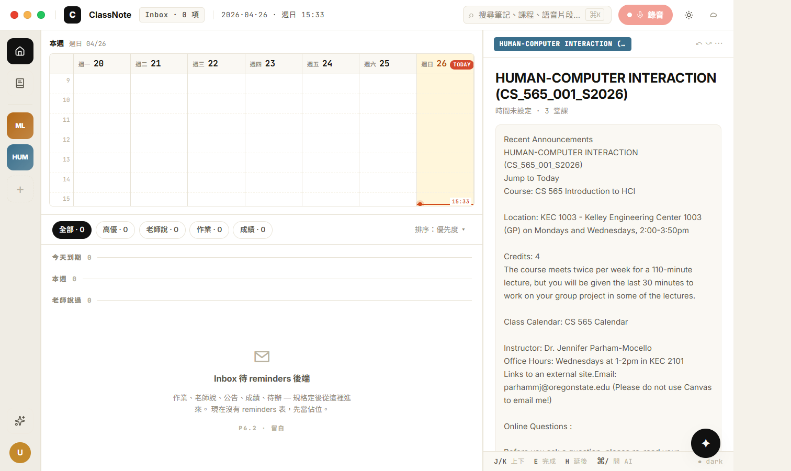
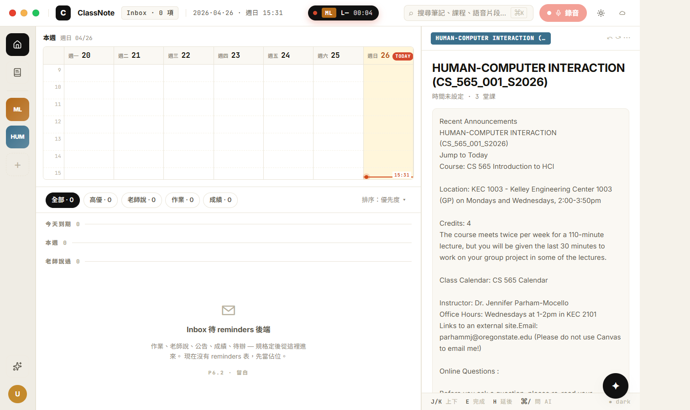
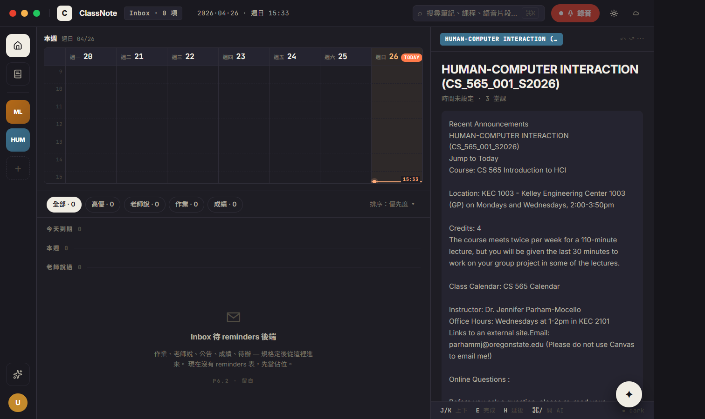

# CP-6.10 · Visual audit pass 1 — TopBar Recording Island + Inbox Indicator

**狀態**：等你 visual review。
**規則**：對照 prototype @ `localhost:5173` 實際 visual，補沒移植到的視覺元件。
**驗證**：`tsc --noEmit` clean、CDP 截圖 (注入 status='recording' lecture 驗 island 出現)。

**分支**：`feat/h18-design-snapshot`

## 動機

User 提示「你會發現有很多東西都沒有移植，你重新去對照一下」。本 CP 對照 prototype 5173（headless Edge + CDP screenshot）跟現實 app，補主要視覺缺漏。

## prototype 比對 reference 截圖

> 在 `docs/design/h18-deep/checkpoints/screenshots/proto-reference-{home,ai}.png`。
> 用 `tmp/cp-6.1/proto-shoot.mjs` 透過 Edge headless CDP 抓的，1440×900 視窗。

prototype reference 顯示出我們這 CP 之前**漏掉**的東西：

1. **TopBar 中央 Recording Island** — 黑色 pill, 紅 dot pulse + 課程縮寫色塊 + L# + mono elapsed。任何頁面都看得到。User 在錄音中切到別頁，這 pill 提醒「你還在錄」。
2. **TopBar 左 Inbox · N 項 indicator** — 在 logo 旁，顯示總未讀 reminder 數。
3. ~~Course chip 右上紅 badge (urgent count)~~ — 留白：reminders schema 沒做。
4. ~~Calendar 7 天滿 events~~ — 留白：使用者只有一門 HCI 課，syllabus.time 沒設。
5. ~~Inbox 8+ rows real reminders~~ — 留白：reminders schema 沒做。
6. ~~Preview HW3 with urgency / AI summary mock~~ — 結構已有 (Preview 元件)，內容隨選 course 變動，沒選 reminder 時不顯示 urgency。

→ 本 CP 補 (1) (2)，其它**留白項目維持留白**，因為 schema 不存在。

## 改了什麼

```
新:
  docs/design/h18-deep/checkpoints/CP-6.10.md
  docs/design/h18-deep/checkpoints/screenshots/cp-6.10-audit-{home-light,home-dark,rec-island}.png
  docs/design/h18-deep/checkpoints/screenshots/proto-reference-{home,ai}.png
  tmp/cp-6.1/proto-shoot.mjs                                · Edge headless CDP 截圖 prototype 工具

改:
  src/components/h18/H18TopBar.tsx                          ·
    · 加 inboxCount + onOpenInbox + activeRecording props
    · 左側 logo 旁 Inbox · N 項 indicator button
    · 中央 .center 區（flex: 1）→ 錄音 island
  src/components/h18/H18TopBar.module.css                   ·
    · .inboxIndicator
    · .center (flex 1 居中)
    · .recIsland + .recIslandDot pulse + .recIslandShort 色塊 + .recIslandLec + .recIslandTime
  src/components/h18/H18DeepApp.tsx                         ·
    · 新增 activeRecLecture state + 4 秒 polling (storageService.listLectures status='recording')
    · 新增 recElapsedSec state + 1 秒 tick 計算 elapsed
    · 算 activeRecording payload 餵給 H18TopBar (course color hash + courseShort)
    · 點 island → 跳 review:cid:lid 路徑 (其實是錄音中的 review 入口)
    · inboxCount 固定 0 (留白)、onOpenInbox 暫時跳 home
```

## 視覺驗證

### 1 · cp-6.10-audit-home-light.png



- [ ] TopBar 左：C logo + ClassNote brand + **Inbox · 0 項 indicator** (mono caps, surface2 chip)
- [ ] TopBar 中：（沒錄音時 empty，center flex 1 撐開）
- [ ] TopBar 右：search ⌘K + 錄音 button + 主題 + TaskIndicator (我們的 extras)
- [ ] 其餘 home 內容 unchanged

### 2 · cp-6.10-audit-rec-island.png



注入 status='recording' 的 lecture，等 4 秒 poll 抓到：

- [ ] TopBar 中央出現 **黑色膠囊 island**：
  - 紅 dot (pulse 1.2s)
  - 課程縮寫色塊（hash 染色）
  - L— mono lecture number (留白：lecture 沒 number 欄位)
  - 00:01 mono elapsed timer (從 lecture.updated_at / created_at 推 startedAtMs，每秒 tick)
- [ ] 點 island → 跳到 review:cid:lid 路徑（實際進入錄音的 review/recording 頁）

### 3 · cp-6.10-audit-home-dark.png



- [ ] dark mode：Inbox indicator chip 切到 dark surface2

## 還沒處理的 prototype gap（次要 / 留白）

跟 prototype 視覺對照後，剩下的差異多數是**資料層**而非結構層：

| Prototype 有 | 我們狀態 | 為什麼不補 |
|----|----|----|
| 6 個 stylized course chip (ML / ALG / OS / LA / STA / CMP) | rail 顯示真實使用者 course (HUM = HCI) | 我們不做 mock 假課程，rail 反映真實資料 |
| Course chip 右上 unread badge (ML=2, OS=1, ...) | 沒 badge | reminders schema 沒做（per P6.2 留白）|
| Inbox 8+ rows reminders | empty state ✉ icon + 留白 hint | 同上 |
| Calendar grid 滿事件 | 從 syllabus.time 推 (HCI 課 syllabus.time 沒填) | 使用者要在課程編輯填上課時間 |
| Preview HW3 urgency bar / AI summary 實內容 | Preview 結構已有，AI 摘要 box 顯示「待生成」 | reminders + concept extraction 沒做 |
| TopBar 沒 主題 / TaskIndicator | 我們有這 2 個 extras | 主題 toggle 是 H18 lock 後 manual override，TaskIndicator 是背景任務監控 — 都實用，保留 |
| AI page header pill「覆蓋 N 份筆記」 | 我們顯示 `llm.chatStream` mono pill | 我們的 AI 是 global，prototype 假設 lecture-scoped RAG |
| AI page sidebar 5 個歷史對話 | 1 個目前 session card | chatSessionService 是 lecture-scoped，全域多 session schema 沒做 |

## 已知 issue

1. **Recording island elapsed 不精準** — 用 `lecture.updated_at` 推 startedAtMs。如果 user 中途編輯 lecture 然後又繼續錄，updated_at 會更新，elapsed 會跳。要精準需 schema 加 `started_at_ms` 欄位。
2. **Polling 4 秒週期** — recording lecture 出現 / 消失最差延遲 4 秒。實務 OK 但可以改 event-driven (dispatch `classnote-lecture-recording-changed` event) 在 useRecordingSession 跟 H18DeepApp 連動。
3. **Inbox indicator 點擊只跳 home** — 應該可以開 inbox-only modal 或 focus inbox section，但目前沒做（home 已經有 inbox 區塊就直接跳）。

## 下一步候選

- 繼續 audit 其他頁面 (course detail / review / recording / profile / search) 看 prototype 還有什麼遺漏的結構
- wiring audit CP — 把 P6.7 settings stubs / Recording 引擎缺漏 (BatteryMonitor / deviceMonitor / 5-step 真事件) 收齊
- legacy 檔案清理 — NotesView / SettingsView / ProfileView / TrashView / CourseListView / CourseDetailView / CourseCreationDialog 不再被 import，可以刪
