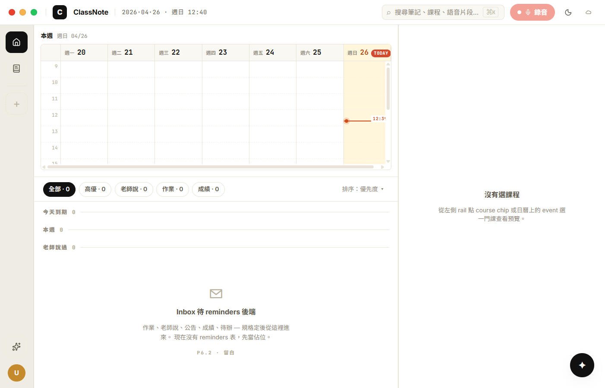
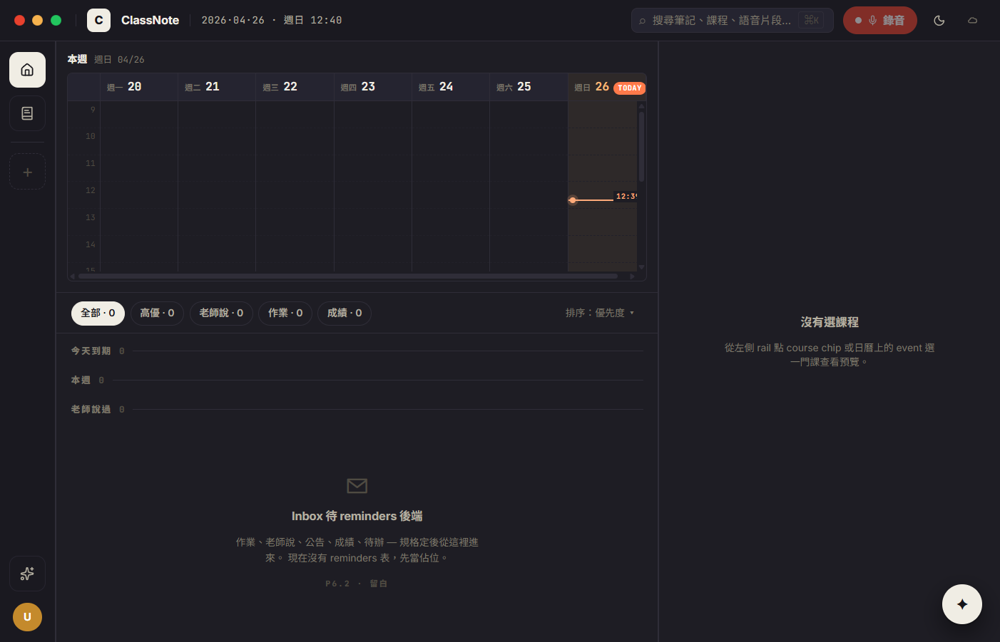

# CP-6.2 · Phase 6 真重寫 — Home (Calendar + Inbox + Preview)

**狀態**：等你 visual review。
**規則**：跟 CP-6.1 一樣 — UI 1:1 / backend wire / 沒做的留白。本 CP 不動 schema、不建 reminders 表，所有 reminder-shaped 區塊都 empty state；calendar events 從 `course.syllabus_info.time` 推得到的就推。
**驗證**：`tsc --noEmit` clean、CDP 截圖 light + dark 兩張 home（empty user 狀態）+ DOM count check（5 filter pills / 1 calendar / 1 inbox / 1 preview）。
**Plan 對應**：`PHASE-6-PLAN.md` § 4 P6.2。

**分支**：`feat/h18-design-snapshot`

## P6.2 commits（這次）

```
feat(h18-cp62): home — H18Calendar + H18Inbox + H18Preview + HomeLayout A
docs(h18): CP-6.2 walkthrough + screenshots
```

合一個 commit 推。

## 啟動

```bash
cd d:/ClassNoteAI-design/ClassNoteAI
npm run dev:ephemeral
```

點 rail ⌂ 首頁（或 app 啟動本來就是 home）→ 看到三欄 home 取代 P6.1 的 placeholder。

## 視覺驗證 — 2 張截圖

> 在 `docs/design/h18-deep/checkpoints/screenshots/cp-6.2-*.png`。**新使用者狀態**（沒任何 course），所以 calendar 沒事件、preview 沒選課程。下一次 review 我會帶有 course + syllabus.time 的截圖。

### 1 · cp-6.2-light-home.png



對應 `h18-app.jsx` HomeLayout variant A + `h18-parts.jsx` H18Calendar + `h18-inbox-preview.jsx` H18Inbox + H18Preview。

- [ ] **Layout**：左欄 1fr · 右欄 380px Preview，欄間 1px h18-border 縫
- [ ] **左欄上半 280px Calendar**：head「本週 週日 04/26」(mono small) + 7-column week grid (週一 20 / 二 21 / 三 22 / 四 23 / 五 24 / 六 25 / 日 26)，週日 column 高亮 `h18-today-bg` 暖黃，TODAY badge 紅膠囊 `h18-dot`
- [ ] **Calendar hour rows 9..20**，dashed `h18-grid-line-soft` 列隔線，左 36px hour label（mono digits）
- [ ] **Now line**：12:38 在週日 column，accent 橫線 + 6×6 dot + mono label `12:38`，背景 `h18-surface` 蓋過 grid line
- [ ] **左欄下半 Inbox**：5 filter pills（全部·0 active 反白 / 高優·0 / 老師說·0 / 作業·0 / 成績·0）+ 排序：優先度 ▾，3 個 group head（今天到期·0 / 本週·0 / 老師說過·0 mono uppercase + rule line）
- [ ] **Inbox empty state**：✉ icon + "Inbox 待 reminders 後端" + 留白 hint + `P6.2 · 留白` mono tag
- [ ] **右欄 Preview**：`沒有選課程` empty state（左 rail 還沒有 course chip 可選）
- [ ] **Top chrome 不變**（CP-6.1 已驗）

### 2 · cp-6.2-dark-home.png



- [ ] 整片切到 `#16151a` 暖近黑底
- [ ] TODAY column 暖黃變 `rgba(255,195,120,0.07)` 微微透出來
- [ ] Inbox empty icon 顏色 `h18-text-faint` 暗灰
- [ ] Preview empty hint 顏色 `h18-text-dim`

## 真接後端的部分

**Calendar 事件**：從每 course 的 `syllabus_info.time` 字串解析（`weekParse.ts`）：
- 支援格式：`週一 14:00-15:30` / `週一、週三 10:00-11:30` / `Mon 14:00-15:30` / `周二 09:00 - 10:30`
- 解析失敗 → 該課就不出現在 calendar 上（不報錯）
- Event 點擊 → `onPickCourse(courseId)` → 更新 `selectedCourseId`（preview 跟著變），並 nav 到 course detail

**Preview 內容**（當有選課程時）：
- title / instructor / time / location / lecture 數 — 全從 `course` + `listLecturesByCourse(id)` 抓
- 最近 3 個 lecture row：日期 + title + duration — 點擊 → `review:courseId:lectureId`
- description 框：直接 render `course.description`，空白顯示 italic 提示
- 進課堂列表 button → `course:courseId`

## 留白部分（per 三條規則）

- **Inbox** — 整個 reminders 後端不存在，filter pills / group heads 全 0，empty state 標明 P6.2 留白
- **Preview AI 摘要區** — 接 lecture summarizer 是 P6.4 review 的活，先 disabled button
- **Preview 鍵盤 footer** — J/K/E/H/⌘/ 顯示但功能不接（留 P6.4 之後接）
- **Preview 延後 / 標記完成** — reminders 後端後啟用，目前 disabled

## 改了什麼

```
新:
  src/components/h18/weekParse.ts                  · syllabus.time → WeekEvent
  src/components/h18/H18Calendar.tsx               · 7-column week grid + now line + events
  src/components/h18/H18Calendar.module.css
  src/components/h18/H18Inbox.tsx                  · filter pills + group heads + empty state
  src/components/h18/H18Inbox.module.css
  src/components/h18/H18Preview.tsx                · course preview with lectures
  src/components/h18/H18Preview.module.css
  src/components/h18/HomeLayout.tsx                · variant A grid orchestrator
  src/components/h18/HomeLayout.module.css
  docs/design/h18-deep/checkpoints/CP-6.2.md
  docs/design/h18-deep/checkpoints/screenshots/cp-6.2-{light,dark}-home.png

改:
  src/components/h18/H18DeepApp.tsx                · home case 換 HomeLayout，加 selectedCourseId state，handleNav 同步 pin Preview
```

CourseListView **還沒退場** — 等下個 CP P6.3（Course detail 整片重寫）一起處理，因為它還是 `course:id` route 的 fallback。

## 已知 issue · 等下個 CP 處理

1. **Calendar event 視覺沒拍到** — 新使用者沒 course；要實機加一門 syllabus.time 是 `週X HH:MM-HH:MM` 的課才能驗。寫死 fixture 截圖會誤導 (P6.2 規則要求 1:1 真資料)，所以 defer 到下次 review。
2. **Preview 「選課程」狀態沒拍到** — 同上，課程存在後 rail course chip 才能點，preview 才會切到「實內容」變體。
3. **HomeLayout B / C 變體沒做** — Q4 lock 為 A 預設，B/C 是 v0.7.x 的事。
4. **Calendar 事件衝突重疊** — 兩門課同時段同一 weekday 推出來會直接重疊，沒做時區衝突的 cascade layout。多堂課的真實情況很罕見，先放著。
5. **`weekday` parse 不支援週末跨日語法** — 例如「週六 22:00 ~ 週日 02:00」會解析失敗整個放棄。狀況罕見。
6. **Now line 在 9:00 之前 / 20:00 之後不顯示** — 下班時間打開 app 看不到 now line 是預期。

## 下個 CP — P6.3 Course

- 重寫 `CourseDetailPage` 對應 `h18-nav-pages.jsx` L283（麵包屑 + 大綱 + 課堂列表）
- 重寫 `AddCourseDialog` 對應 L774（H18 styled card overlay）
- CourseDetailView / CourseCreationDialog (legacy) 退場
- 接 storageService.saveCourseWithSyllabus / listLecturesByCourse 全部既有

review 完點頭就推。
