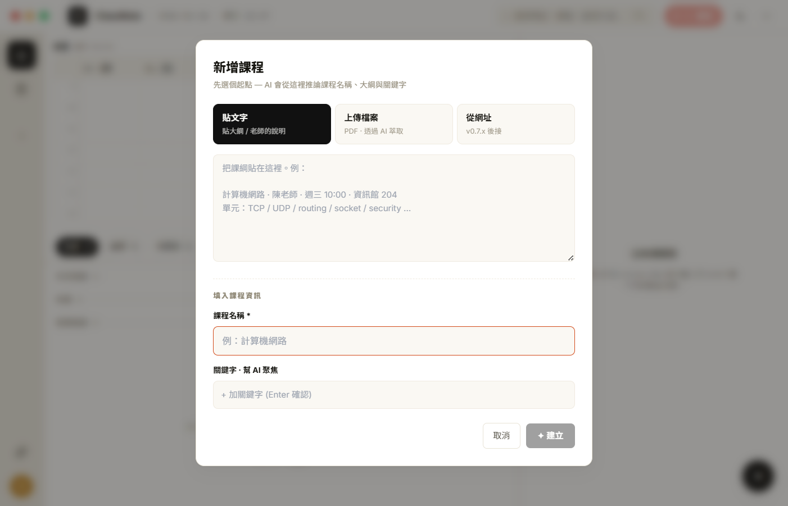
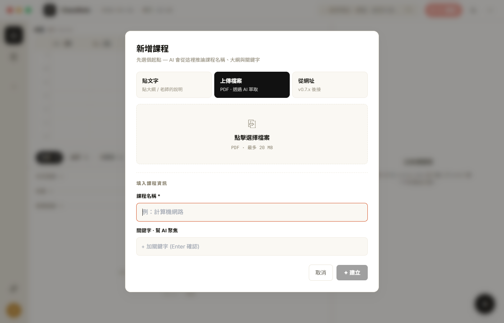
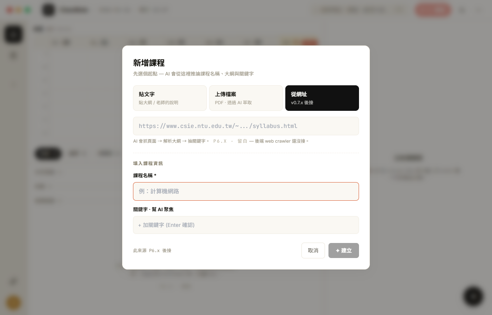
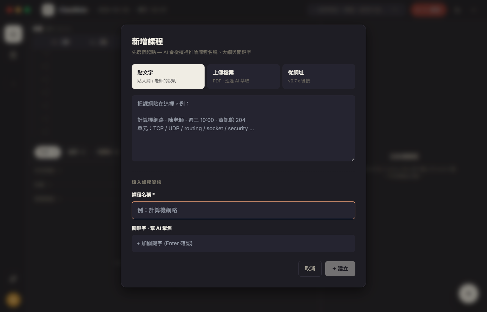
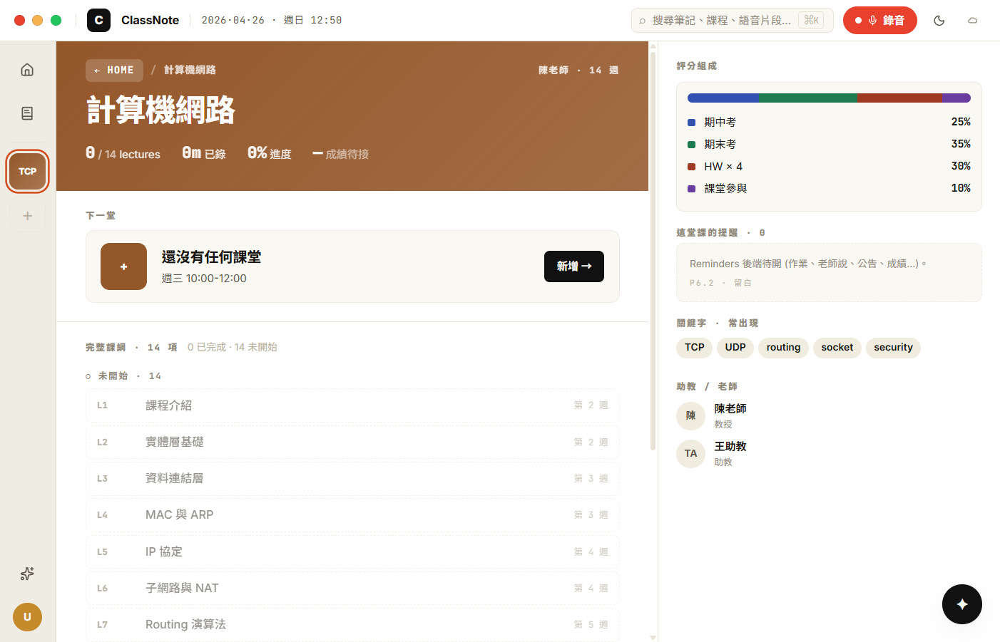
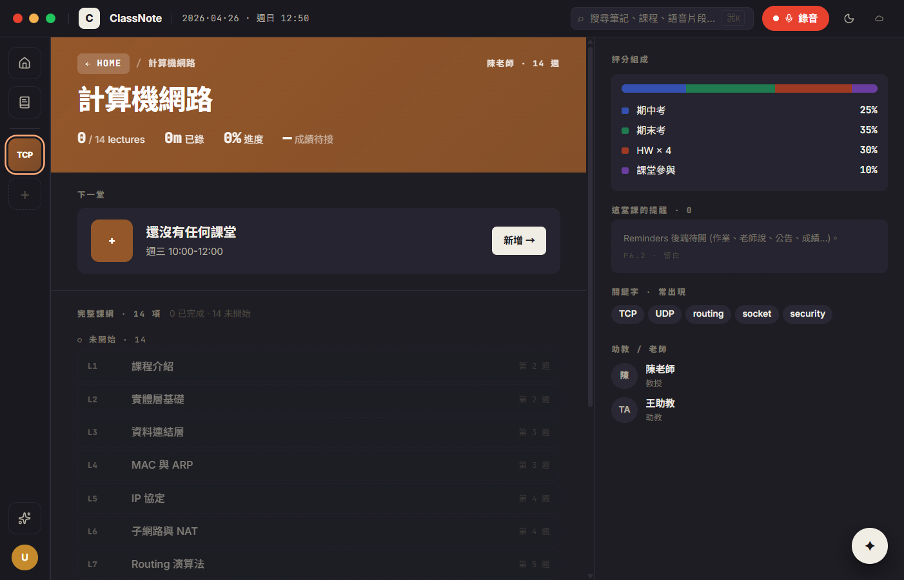

# CP-6.3 · Phase 6 真重寫 — Course detail + Add course dialog

**狀態**：等你 visual review。
**規則**：UI 1:1 / backend wire / 沒做的留白。
**驗證**：`tsc --noEmit` clean、CDP 截圖 6 張 (dialog 3 tabs × 2 themes + course detail light/dark)，包含實機注入測試課程驗 syllabus_info / grading / schedule 全條 wire 路徑（截完即清，不留垃圾資料）。
**Plan 對應**：`PHASE-6-PLAN.md` § 4 P6.3。

**分支**：`feat/h18-design-snapshot`

## P6.3 commits（這次）

```
feat(h18-cp63): course detail page + add course dialog (H18 重寫)
docs(h18): CP-6.3 walkthrough + screenshots
```

合一個 commit 推。

## 啟動

```bash
cd d:/ClassNoteAI-design/ClassNoteAI
npm run dev:ephemeral
```

從 home 點 rail 上的 + 開 dialog；建立後 rail course chip 出現，點進去就是 H18 CourseDetailPage。

## 視覺驗證 — 6 張截圖

> 在 `docs/design/h18-deep/checkpoints/screenshots/cp-6.3-*.png`。
> Course detail 用 CDP 注入了 `cp63-screenshot-*` 暫時資料拍照（有完整 syllabus_info），截完已清光，user DB 沒有殘留。

### 1 · cp-6.3-dialog-text-light.png — 貼文字 tab



對應 `h18-nav-pages.jsx` L774-913 (AddCourseDialog) tab=text default。

- [ ] **scrim** 0.45 黑紗 + backdrop blur，body 模糊
- [ ] **modal** 560px 卡片，rounded 12，h18-shadow
- [ ] 標題 「新增課程」+ hint 「先選個起點 — AI 會從這裡推論課程名稱、大綱與關鍵字」
- [ ] **3 個 source tabs**：貼文字 (active 反白)、上傳檔案、從網址 — 每個 tab 都有 label + 小 hint，active tab 用 invert + invertInk
- [ ] **Body**：textarea (rows=7) placeholder 樣本資料
- [ ] divider 「填入課程資訊」(mono caps)
- [ ] **課程名稱** input * + autofocus 顯示橘 accent 邊框
- [ ] **關鍵字** chip field：placeholder 「+ 加關鍵字 (Enter 確認)」，現在空所以一行
- [ ] **Footer**：取消 (ghost) + ✦ 建立 (primary inverted, currently disabled because title is empty)

### 2 · cp-6.3-dialog-file-light.png — 上傳檔案 tab



- [ ] tab 切換到 「上傳檔案」反白
- [ ] **大型 dashed border 區塊**：⎘ icon、「點擊選擇檔案」、「PDF · 最多 20 MB」(mono)
- [ ] 點擊呼叫 `selectPDFFile` → 選完顯示 「✓ filename · XX KB」綠 sel-bg row
- [ ] 寬度跟 dialog 內距對齊 (P6.3 build 過程修過 — 第一版 button 沒 width: 100%)

### 3 · cp-6.3-dialog-url-light.png — 從網址 tab (留白)



- [ ] tab 切換到 「從網址」反白
- [ ] URL input **disabled**（背後 web crawler 沒接）
- [ ] 下方提示文字：解釋 AI 會抓 syllabus 頁，然後 mono caps `P6.X · 留白` — 後端 web crawler 還沒接

### 4 · cp-6.3-dialog-dark.png — dark mode



- [ ] 整片切到 `#1e1d24` h18-surface
- [ ] textarea 變 `#252430` h18-surface2
- [ ] active tab 變暖白 invert + 深字 invertInk
- [ ] 邊框、divider 全切 dark-mode tokens

### 5 · cp-6.3-course-detail-light.png — Course detail (real data wire)



對應 `h18-nav-pages.jsx` L283-601 (CourseDetailPage)，注入測試 syllabus 包含完整 grading + schedule。

- [ ] **左 1fr 主內容欄**：
  - **Hero** gradient `linear-gradient(135deg, ${color}, ${color}dd)` 暖橘銅，breadcrumb `← HOME / 計算機網路` 半透白 pill，右上 mono `陳老師 · 14 週` extra
  - 標題 `計算機網路` 34px bold
  - Stats row：`0 / 14 lectures` `0m 已錄` `0% 進度` `— 成績待接` (mono digits + label)
  - **Next card** 「下一堂」eyebrow + 大色塊 `+` icon + 「還沒有任何課堂」title + 「週三 10:00-12:00」meta (從 syllabus.time)+ 新增 → button (invert)
  - **完整課綱** group：14 項 mono caps，下面 ○ 未開始 · 14 list (dashed border, opacity 0.65)，每 row：L{n} mono code · 標題 · 第 X 週 meta — title 直接從 `syllabus_info.schedule[]` 拿
- [ ] **右 380px panel**：
  - **評分組成** mono caps + stacked bar (期中 25% 藍 / 期末 35% 綠 / HW 30% 紅 / 課堂 10% 紫) + 4 row breakdown — 全來自 `syllabus_info.grading[]`
  - **這堂課的提醒 · 0** + dashed empty state with `P6.2 · 留白` tag
  - **關鍵字** TCP UDP routing socket security chips — 從 `course.keywords` (split by ,)
  - **助教 / 老師** 兩張 row：陳 (avatar 第一字) 陳老師 教授 / TA avatar 王助教 助教 — 從 `syllabus.instructor` + `syllabus.teaching_assistants`

### 6 · cp-6.3-course-detail-dark.png



- [ ] 大底 `#16151a` 暖近黑
- [ ] Hero gradient **不變**（按 prototype，hero 永遠是 course color，不跟 theme）
- [ ] 評分組成 grading bar 在暗底依舊清晰
- [ ] keyword chips 從 `#f0ece0` chip-bg → `#2a2834` 暗版 chip-bg
- [ ] 人物 avatar 圈也切到 chip-bg dark

## 真接後端的部分

| 元件 | 接哪 |
|------|------|
| AddCourseDialog 貼文字 | `storageService.saveCourseWithSyllabus(c, { triggerSyllabusGeneration: true })` — 後端跑 AI 解析 description → syllabus_info |
| AddCourseDialog 上傳檔案 | `selectPDFFile` → `saveCourseWithSyllabus(c, { pdfData, triggerSyllabusGeneration: true })` |
| AddCourseDialog 從網址 | **留白** — UI disabled，後端 crawler 沒接 |
| CourseDetailPage `course` | `storageService.getCourse(id)` |
| CourseDetailPage lectures | `storageService.listLecturesByCourse(id)` |
| CourseDetailPage 進課堂 | `onSelectLecture(id)` → `review:cid:lid` route |
| CourseDetailPage 新增課堂 | `storageService.saveLecture({status: 'recording'})` → `review:cid:newId` |
| CourseDetailPage 評分 | `course.syllabus_info.grading[]` |
| CourseDetailPage 課綱 schedule | `course.syllabus_info.schedule[]` |
| CourseDetailPage 關鍵字 | `course.keywords.split(/[,，、]/)` |

## 留白部分

- **這堂課的 reminders** — 沒 schema，`P6.2 · 留白` tag
- **每 lecture 的 ★ key count** — 沒 concept extraction
- **每 lecture 已複習 / NEW** — 沒 reviewed 欄位
- **加權平均成績** — `成績待接`，沒 grade / score 欄位
- **下一堂的「1h 52m 後開始」倒數** — 沒接時間計算
- **老師 / 助教 email** — 我們不存 email
- **AddCourseDialog 「從網址」tab** — input disabled，crawler 沒接

## 改了什麼

```
新:
  src/components/h18/CourseDetailPage.tsx                   · 1fr | 380px H18 重寫，全部接 storageService
  src/components/h18/CourseDetailPage.module.css
  src/components/h18/AddCourseDialog.tsx                    · 3-tab + chip keyword field
  src/components/h18/AddCourseDialog.module.css
  docs/design/h18-deep/checkpoints/CP-6.3.md
  docs/design/h18-deep/checkpoints/screenshots/cp-6.3-*.png

改:
  src/components/h18/H18DeepApp.tsx                         · `course` / `recording` route 接 H18 CourseDetailPage；dialog 接 H18 AddCourseDialog
```

**Legacy 已不再被路由引用但檔還在 disk**：`CourseDetailView.tsx` + `CourseListView.tsx` + `CourseCreationDialog.tsx`。等到 P6.7 一起清。

## 已知 issue · 等下個 CP 處理

1. **L number 計算偏差** — 「已完成」用 `sortedLectures.length - idx` 算 L 編號，但對「未開始」用 `sortedLectures.length + i + 1`。中間 inProgress 算 L_? 沒處理。等真實情境拿到再 finetune（多數 course 不會有 inProgress）。
2. **schedule 比 lectures 短** — 假設 schedule 一定 ≥ lectures。實際可能反過來（lecture 多了 syllabus 沒列）。目前是「lecture 全列出 + schedule 後段補」，OK 但概念不嚴謹，等 P6.4 review 之後 finetune。
3. **next card 不分 「下一堂預定」 vs 「進行中」** — 邏輯：找 `status='recording'` 就顯 `REC` icon + 繼續；否則顯 `+` 與 `新增 →`。沒做「最新 completed lecture 之後的下一週課題」。
4. **Hero gradient 不切 theme** — prototype 也這樣。視覺對暗模式下對比較重，但保持一致。
5. **404 找不到課** — 用「找不到這門課」+ 返回 home button 處理。

## 下個 CP — P6.4 Review

P6.4 是 review 三欄頁。對應 `h18-review-page.jsx` L436+：
- 左 TOC（章節從 lecture summary 抽）
- 中逐字稿 + bilink
- 右 Tabs (notes / exam / summary)
- 底部 H18AudioPlayer 52px
- 退場 NotesView 的 review mode（先保留 recording 模式）

review 完點頭就推。
