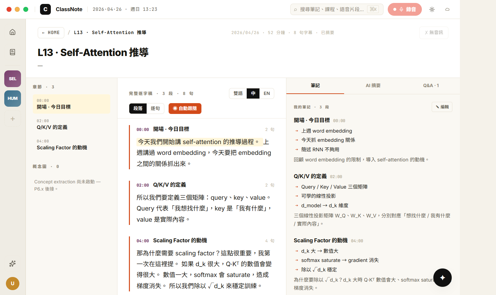
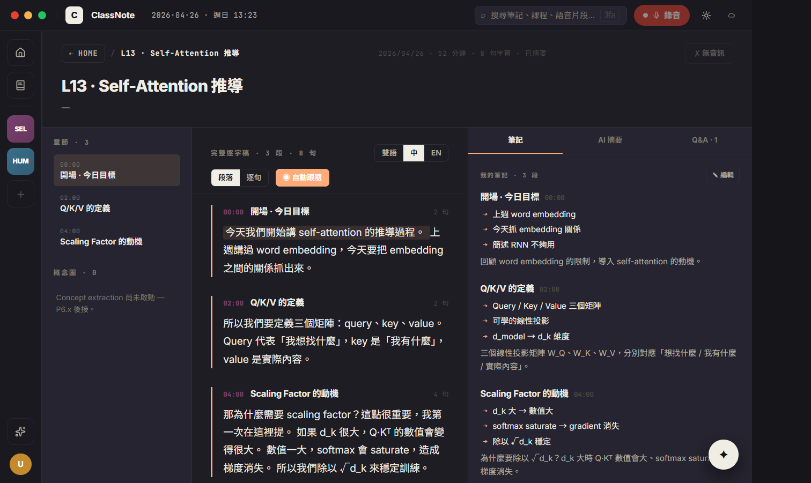
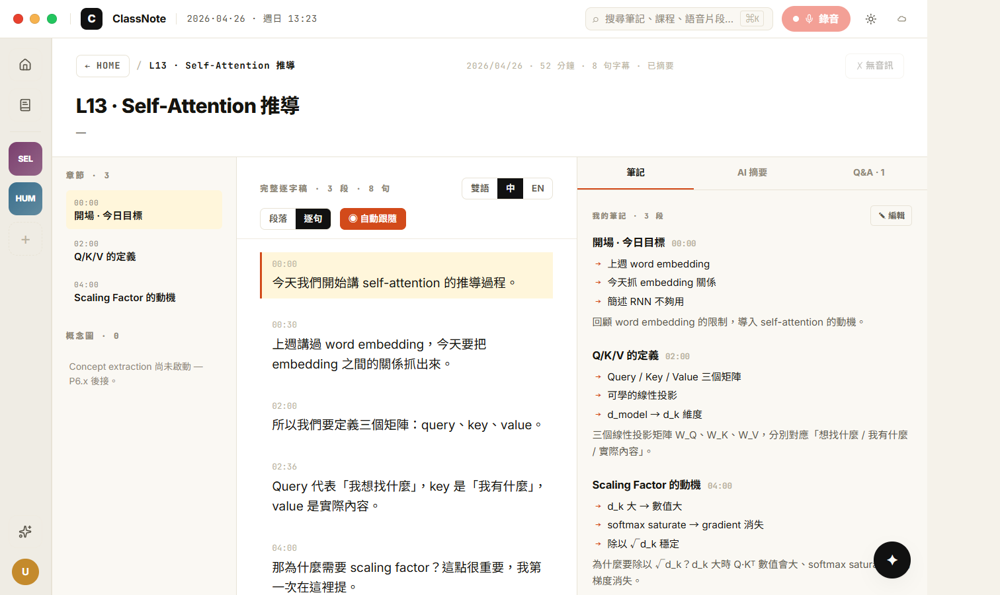
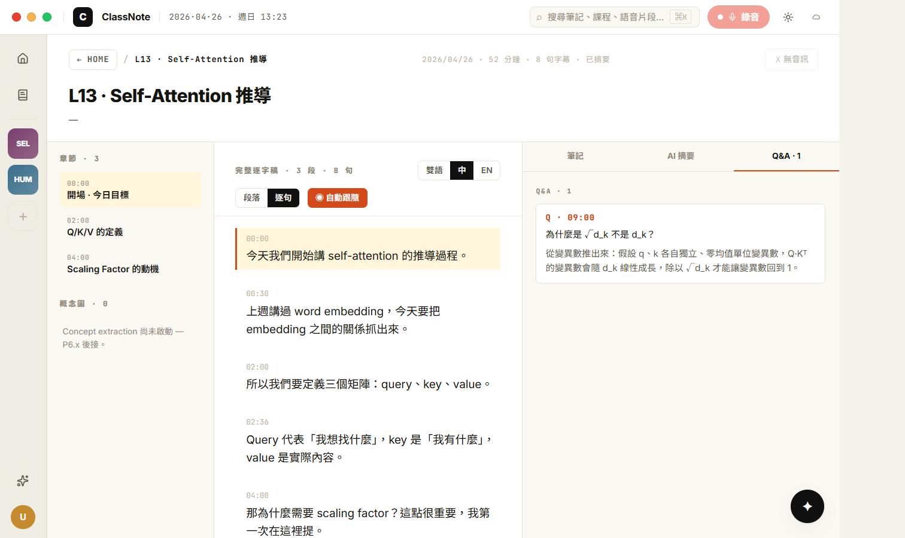
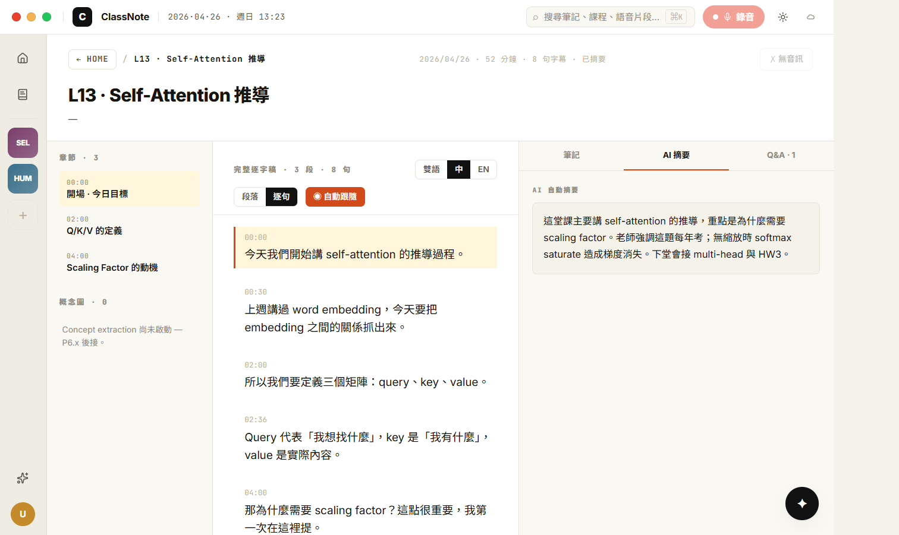

# CP-6.4 · Phase 6 真重寫 — Review page (3-column transcript + tabs + audio bar)

**狀態**：等你 visual review。
**規則**：UI 1:1 / backend wire / 沒做的留白。
**驗證**：`tsc --noEmit` clean、CDP 截圖 5 張（para 模式 light/dark + sent 模式 + Q&A tab + AI 摘要 tab）。實機注入 lecture + 8 subtitles + Note(sections + summary + qa) 拍完即清。
**Plan 對應**：`PHASE-6-PLAN.md` § 4 P6.4。

**分支**：`feat/h18-design-snapshot`

## P6.4 commits（這次）

```
feat(h18-cp64): review page — 3-column transcript + tabs + audio bar
docs(h18): CP-6.4 walkthrough + screenshots
```

合一個 commit 推。

## 啟動

```bash
cd d:/ClassNoteAI-design/ClassNoteAI
npm run dev:ephemeral
```

從 home → rail course chip → CourseDetailPage → 點任一已完成 lecture 就進 H18ReviewPage。

## 視覺驗證 — 5 張截圖

> 在 `docs/design/h18-deep/checkpoints/screenshots/cp-6.4-*.png`。
> Lecture / subtitles / note 用 CDP 注入測試資料拍照，截完已 hard-delete，user 真實的 HCI 課程未被觸碰。

### 1 · cp-6.4-review-para-light.png — 段落模式 + 筆記 tab (default)



對應 `h18-review-page.jsx` L436-895 (ReviewPage)。

- [ ] **Hero** (h18-surface bg)：← HOME / L13 · Self-Attention 推導 麵包屑 + 右上 mono `2026/04/26 · 52 分鐘 · 8 句字幕 · 已摘要` extra + 右上 disabled `✗ 無音訊` button (這個 lecture 沒 audio_path)
- [ ] 標題 `L13 · Self-Attention 推導` 24px bold
- [ ] meta `關鍵字：Q/K/V, scaling, ...` (從 lecture.keywords)
- [ ] **3-column body** 220px | 1fr | 420px，欄間 1px h18-border
- [ ] **TOC 章節 · 3**：開場 · 今日目標 / Q/K/V 的定義 / Scaling Factor 的動機 (從 note.sections，按 timestamp 排序，點擊 → seek audio)
- [ ] **TOC 概念圖 · 0** + 留白 hint
- [ ] **Transcript head**：`完整逐字稿 · 3 段 · 8 句` mono caps + 雙語/中(active)/EN toggle + 段落(active)/逐句 toggle + ◉ 自動跟隨 (orange filled)
- [ ] **段落模式**：3 個 paragraph block，每個帶 timestamp pill + section title (從 note.sections) + N 句 count，paragraph 內所有 subtitle 連成自然語段（按 H18 prototype 設計，不是 1 句 1 行）
- [ ] **右 tabs**：筆記 (active, accent underline) / AI 摘要 / Q&A · 1
- [ ] **筆記 tab**：3 個 section card，title + 章節時間 mono link + bullets (→ accent prefix) + content。可 ✎ 編輯 切到 textarea。

### 2 · cp-6.4-review-para-dark.png — dark mode 同畫面



- [ ] 大底切到 `#16151a` 暖近黑
- [ ] TOC `surface2` `#252430` 比 transcript 區的 `surface` 稍亮
- [ ] 段落 border-left accent 在暗底依舊明顯
- [ ] 筆記 section bullets `→` accent prefix 顏色切到 dark accent

### 3 · cp-6.4-review-sent-mode.png — 逐句模式 + Q&A tab



- [ ] grouping toggle 切到 「逐句」(invert active)
- [ ] **每句一 row**：左邊 mono timestamp（00:00 / 00:30 / 02:00 / 02:36 / 04:00 / 05:40 / 07:00 / 09:00），下面中文/英文，hover row 變 row-hover bg
- [ ] **Active sub** (currentSec=0 因為沒播放)：第一句 highlight 底色
- [ ] **Q&A tab**: `Q · 09:00 為什麼是 √d_k 不是 d_k？` + answer 從 note.qa_records 抽

### 4 · cp-6.4-review-qa-tab.png — Q&A tab focus



- [ ] tab 切到 `Q&A · 1`，accent underline 移過去
- [ ] 唯一一筆 record 渲染為 card：`Q · 09:00` 大寫 mono caps + 問題 + 答案 (text-mid)

### 5 · cp-6.4-review-summary-tab.png — AI 摘要 tab



- [ ] tab 切到 `AI 摘要`
- [ ] 卡片渲染 `note.summary` 字串（這次注入 4 句的整理）

## 真接後端的部分

| 元件 | 接哪 |
|------|------|
| 標題 / 日期 / duration | `storageService.getLecture(lectureId)` |
| 關鍵字 / 音訊 / 影片 / PDF 提示 | lecture.keywords / audio_path / video_path / pdf_path |
| 字幕 | `storageService.getSubtitles(lectureId)` |
| 章節 (TOC) | `note.sections` (sorted by timestamp) |
| 段落分組 | `groupSubsBySections` — 用 section.timestamp 切 subs 為段 |
| 筆記 sections | `note.sections` (title / content / timestamp / bullets / page_range) |
| AI 摘要 | `note.summary` |
| Q&A | `note.qa_records` |
| 音訊播放源 | `resolveOrRecoverAudioPath` (audio) 或 `convertFileSrc(video_path)` (video) → `<audio>` |
| Auto-follow | `<audio>` `timeupdate` event → 找到 timestamp ≤ currentSec 最大的 subtitle → `scrollIntoView` |
| 章節跳播 | TOC 點擊或筆記 section title 旁時間 → setSeekTo → `audio.currentTime = sec` |

## 留白部分（per "沒做的後端就留白"）

- **bilink concept hover** (RVBilink) — concept extraction 沒做；transcript 是純文字，沒 inline link
- **概念圖 list** — 同上，TOC 下面顯示「P6.x 後接」
- **「考點」段落 highlight** — subtitle 沒 exam 欄位；H18 prototype 用 `s.exam` flag 自動標紅，這裡略
- **筆記編輯保存** — `✎ 編輯` 切到 textarea 但**沒接 save handler**，重整就丟失。原因：legacy NotesView 的 markdown 解析回 sections 邏輯太重，等 P6.x 真做完整 markdown round-trip 再接。
- **PDF 對齊 / page_range** — section.page_range 存了但 review 沒用（NotesView 的 PDF panel 是另一條路徑，P6.x 後決定要不要併進來）
- **Bilink 跳對應 lecture** — `onJumpLecture(n)` 沒接

## 改了什麼

```
新:
  src/components/h18/H18AudioPlayer.tsx                     · 真 <audio> + 速度 / 跳秒 / scrubber
  src/components/h18/H18AudioPlayer.module.css
  src/components/h18/H18ReviewPage.tsx                      · 整片 review page (hero + 3col + audio slot)
  src/components/h18/H18ReviewPage.module.css
  docs/design/h18-deep/checkpoints/CP-6.4.md
  docs/design/h18-deep/checkpoints/screenshots/cp-6.4-*.png

改:
  src/components/h18/H18DeepApp.tsx                          · review:cid:lid → H18ReviewPage；NotesView import 移除（recording 路徑 P6.5 才接）
```

**Legacy `NotesView.tsx` 已不再被 H18DeepApp import**，但 disk 上仍保留（recording mode 內邏輯太大，P6.5 才砍）。

## 已知 issue · 等下個 CP 處理

1. **Auto-follow 在沒在播放時也會 highlight 第一句** — 因為 `currentSec=0` 時所有 timestamp ≥ 0 的字幕中最大的就是 t=0 的那句。沒影響操作。
2. **筆記編輯沒 save** — 上面留白
3. **Q&A tab 計數混入 examCount 變數名** — code 用 `note.qa_records.length`，UI label 寫 `Q&A · N`，但檔內變數叫 `examCount` (從 prototype `考點 · N`)。功能對。
4. **影片時 transcript 沒同步** — H18AudioPlayer 用 `<audio>` 元素，影片只取音軌；如果使用者在 NotesView 用 video panel 看時 review 不會聯動。P6.5 video PiP 整合時再處理。
5. **章節 highlight (active TOC row)** — 現在用 `paragraphs.find(...activeSubId 在裡面)` 偵測，但段落分組用 section.timestamp 為 boundary，邏輯一致；如果 `activeSubId=null`（剛開頁面或音訊未播）→ 沒 row highlight，預期行為。
6. **沒重設 seekTo prop**：H18AudioPlayer 收到 seekTo 後 internal 用 useEffect 跑 `audio.currentTime = seekTo`。重複點同一個 timestamp 不會 retrigger（state 沒變）。實際使用沒問題，理論上要 nonce。

## 下個 CP — P6.5 Recording

P6.5 是 recording page。對應 `h18-recording-v2.jsx` L549+：
- Layout A 為主（投影片大 + 右下 transcript stream）
- RV2FinishingOverlay 5-step 結束過場
- RV2FloatingNotes 浮動筆記
- 退場 NotesView 的 recording mode（這個 CP 終於可以砍 NotesView.tsx）
- 接現有 AudioRecorder + Parakeet ASR + accumulator（state machine 不動）

review 完點頭就推。
