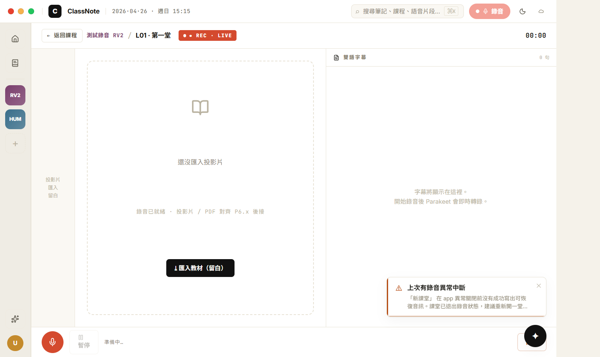
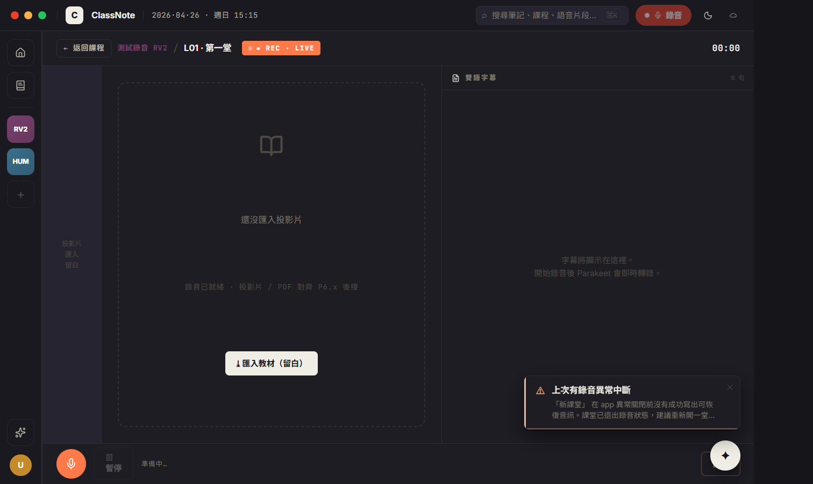

# CP-6.5+ · 真 RV2 Recording Layout (chrome wrap 退場) + 視窗拖動修復

**狀態**：等你 visual review。
**規則**：UI 1:1 / backend wire / 沒做的留白。
**驗證**：`tsc --noEmit` clean、CDP 截圖 light/dark 兩張、Tauri `start_dragging` invoke 通過。
**Plan 對應**：`PHASE-6-PLAN.md` § 4 P6.5（接續 CP-6.5 的 chrome wrap，這次真做 RV2 Layout）。

**分支**：`feat/h18-design-snapshot`

## 兩件事

1. **CP-6.5+ recording 真重寫**：取代上次的 LIVE banner + NotesView host。新的 H18RecordingPage 有 RV2 Layout A 三欄結構 + 5-step finishing overlay + 用 `useRecordingSession` hook 直接接 AudioRecorder + transcriptionService + subtitleService。
2. **視窗拖動修復**：`tauri.conf.json` 翻 `decorations: false` 之後視窗拖不動 — 因為 `core:window:allow-start-dragging` permission 沒加進 capabilities。加進 `default.json` 後 `start_dragging` 真實 invoke 通過。

## P6.5+ commits（這次）

```
fix(tauri): allow-start-dragging + allow-internal-toggle-maximize for decoration-less window
feat(h18-cp65plus): RV2 Layout A (slide strip + subtitle stream + 5-step finishing)
docs(h18): CP-6.5+ walkthrough + screenshots
```

合一個 commit 推。

## 啟動

```bash
cd d:/ClassNoteAI-design/ClassNoteAI
npm run dev:ephemeral
```

Tauri capabilities 變了 → Rust 會 recompile（~30s 增量）。

進 course detail → 點「新增 →」（next card）→ 自動建 status='recording' 的 lecture → 跳 H18RecordingPage（RV2 Layout A）。

**測試拖動**：點 topbar 上面除了 traffic lights / search / 錄音 / 主題 / TaskIndicator 以外的區域（datetime mono 文字、logo 跟 brand 之間的縫、空白處）→ 應該可以拖視窗。

## 視覺驗證 — 2 張截圖

> 在 `docs/design/h18-deep/checkpoints/screenshots/cp-6.5plus-rv2-{light,dark}.png`。
> 用 CDP 注入 status='recording' 的 lecture 拍完即清。

### 1 · cp-6.5plus-rv2-light.png



對應 `h18-recording-v2.jsx` RecordingPage + RV2LayoutA + RV2Transport + RV2FinishingOverlay。

- [ ] **Hero**：← 返回課程 mono + 課程標題 (course color accent) + / + L01 · 第一堂 + **● REC · LIVE** 紅 pulse pill (mono caps) + 右側 mono `00:00` elapsed timer
- [ ] **Body 86px | 1fr | 460px** grid：
  - **左 86px slide strip**：mono caps「投影片 / 匯入 / 留白」（PDF 對齊沒接）
  - **中央 main slide**：dashed border empty card + 📖 BookOpen icon + 「還沒匯入投影片」+ 「錄音已就緒 · 投影片 / PDF 對齊 P6.x 後接」 + ⤓ 匯入教材（留白）button (disabled invert)
  - **右 460px subtitle stream**：頁首 📄 雙語字幕 mono caps + N 句 count + body「字幕將顯示在這裡 / 開始錄音後 Parakeet 會即時轉錄」empty state
- [ ] **Bottom transport (60px)**：
  - 大紅 REC button (44px circle, 🎙 mic icon) — recording 中變黑 + Square icon
  - ⏸ 暫停 / ▶ 繼續 ghost button (disabled until 開始錄音)
  - 狀態 mono：「準備中… / ● REC · N 句 / 已暫停 / 處理中… / 已完成 / 錯誤」
  - 右下：⚠ 錯誤訊息 (如有) + 關閉 hot-styled button
- [ ] AI fab ✦ 在 right-bottom

### 2 · cp-6.5plus-rv2-dark.png



- [ ] 整片 dark surface
- [ ] LIVE pill 依舊紅 (h18-dot)
- [ ] 投影片留白文字依舊可讀
- [ ] 字幕 stream 區也切 dark surface

## 真接後端的部分

| 元件 | 接哪 |
|------|------|
| AudioRecorder | 新 instance 在 hook ref，updateConfig + enablePersistence + start / pause / resume / stop / getWavData / finalizeToDisk |
| transcriptionService | clear / setLectureId / setLanguages / start / stop |
| subtitleService | subscribe → live segments + currentText |
| audioDeviceService | preparePreferredInputDeviceForRecording |
| storageService | getLecture (auto-flip status='recording')、saveLecture (final status='completed' + audio_path) |
| `finalize_recording_audio` (via `finalizeToDisk`) | .pcm → .wav crash-safe finalize |
| `write_binary_file` fallback | in-memory WAV 寫入備援 |
| `core:window:allow-start-dragging` | capabilities 加進去，drag region 真實有效 |

## 留白 / 已知 regression（vs legacy NotesView 的 recording mode）

⚠️ 這是**減量重寫**，以下功能沿用 NotesView 的部分**沒搬過來**：

- **BatteryMonitor**（10% 警告 / 5% 強制 stop） — 沒接
- **recordingDeviceMonitor**（麥克風熱拔插提示） — 沒接
- **alignment banner / unofficial channel warning** — 沒接（這些是 App.tsx mount 的 overlay，仍會顯示，但不會在 recording page 內主動觸發提示）
- **PDF 投影片對齊 / `extractKeywords` from PDF** — 沒接（slide strip 完全 empty）
- **iPad mirror / floating notes window** — 沒做
- **drag-drop 教材匯入** — 沒接
- **kbd shortcut**: `⌘⇧N` (floating notes) / `Esc` (close) — 沒接
- **5-step finishing overlay 的步驟事件** — UI 在，但跑的是 fixed 720ms × 5 timer 模擬。對應後端的 transcribe / segment / summary / index 階段事件**沒監聽**（5-step 走完就讓使用者點「完成 →」，實際後端 summarizer 還在 background 跑，不阻塞）

下個 wiring audit CP 會把 BatteryMonitor / deviceMonitor / 真 5-step 事件補上。

## 改了什麼

```
新:
  src/components/h18/useRecordingSession.ts                · AudioRecorder + transcription + subtitleService 包成 hook
  docs/design/h18-deep/checkpoints/CP-6.5+.md
  docs/design/h18-deep/checkpoints/screenshots/cp-6.5plus-rv2-{light,dark}.png

改:
  src/components/h18/H18RecordingPage.tsx                  · 整片重寫，從 NotesView host wrapper 改成 RV2 Layout A
  src/components/h18/H18RecordingPage.module.css            · 同上整片改寫
  src-tauri/capabilities/default.json                       · 加 core:window:allow-start-dragging + allow-internal-toggle-maximize
```

**Legacy NotesView.tsx 還在 disk** — H18ReviewPage 不再 import 它（recording 路徑改走 H18RecordingPage），但檔案保留以防回退需要。下個 wiring audit CP 一起清。

## 已知 issue

1. **5-step finishing 是 cosmetic 計時器** — 不對應後端真實階段。720ms × 5 = 3.6 秒走完。如果後端 summarizer 跑得比較慢，使用者看到「完成」但其實 summary 還在 background。實務 OK 因為 review page 自己會刷 lecture.notes.summary。
2. **錄音中熱拔耳機** — 沒 deviceMonitor，audioRecorder 內部會收到 `mediastream.ended` 但 hook 沒傳出 user 通知。可能會偵測到流中斷但靜默。
3. **低電量** — 沒 BatteryMonitor，filesystem 5s flush 仍在跑（recovery 模式可救），但不會主動提示。
4. **getUserMedia 失敗** — 例如沒授權麥克風時，hook setError 顯示在底部 `⚠ ...`。但不會主動跳 setup wizard。
5. **元件 unmount 時** — useEffect cleanup 有 stop()，但如果 unmount 期間 stop() 還在跑（async），race 可能導致 .pcm 沒 finalize。實務上影響小。

## UI 階段的 Phase 6 status

| CP | Commit | UI |
|---|---|---|
| P6.1 Chrome | `7f65267` | ✅ |
| P6.2 Home | `3b18315` | ✅ |
| P6.3 Course | `8fab0cc` | ✅ |
| P6.4 Review | `0ac31d5` | ✅ |
| P6.5 Recording (chrome wrap) | `0e2900c` | superseded |
| **P6.5+ RV2** | (this CP) | ✅ |
| P6.6 AI | `78008f2` | ✅ |
| P6.7 Settings | `13684fa` | ✅ |
| P6.8 Search ⌘K | `1efe7a9` | ✅ |
| P6.9 NotesEditor | `987a82a` | ✅ |

UI 全做完。下個 CP 是 **wiring audit** — 把所有 stub 控件補上 storageService 寫入、補 BatteryMonitor / deviceMonitor、5-step finishing 接真實事件、清掉 legacy 檔案 (NotesView / SettingsView / ProfileView / TrashView / CourseListView / CourseDetailView / CourseCreationDialog)。

review 完點頭就推 wiring audit。
