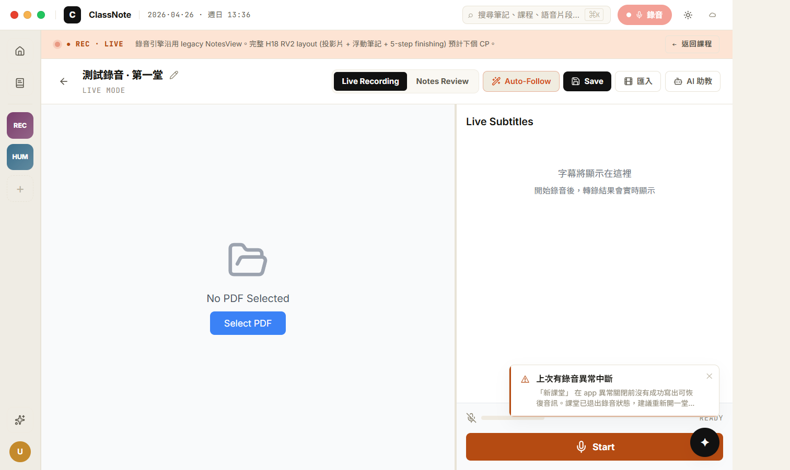
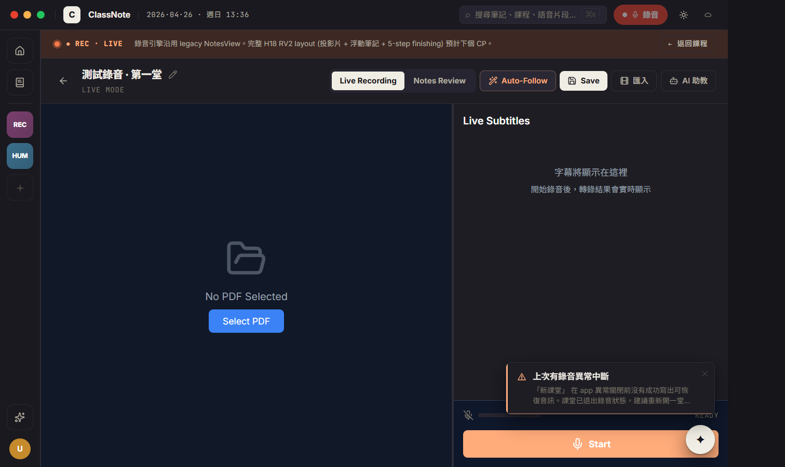

# CP-6.5 · Phase 6 真重寫 — Recording chrome wrap (full RV2 layout 預計下個 CP)

**狀態**：等你 visual review。
**規則**：UI 1:1 / backend wire / 沒做的留白。
**驗證**：`tsc --noEmit` clean、CDP 截圖 light + dark 兩張，注入 status='recording' 的 lecture 拍完即清。
**Plan 對應**：`PHASE-6-PLAN.md` § 4 P6.5。

**範圍誠實說明**：本 CP **不是**完整的 RV2 layout 重寫。NotesView 的 recording engine（AudioRecorder + Parakeet ASR + accumulator + recordingDeviceMonitor + recordingRecoveryService + start/pause/stop/resume state machine + crash recovery + alignment banner + 結束流程）在 NotesView 內部 1900+ 行緊耦合，硬拆 hook 容易回歸風險高。違反 memory rule「verification discipline #1：not declare done without exercising the actual code path」。

故 P6.5 拆成兩 CP：
- **CP-6.5（本次）** = chrome wrap：route lecture.status='recording' → 新 H18RecordingPage，加 H18 LIVE banner，內部 host = legacy NotesView（recording engine 完全沿用）。
- **CP-6.5+（下次）** = 真 RV2 layout：投影片 strip + transcript stream + 浮動筆記窗 + 5-step finishing overlay，把 NotesView recording mode 退場。

**分支**：`feat/h18-design-snapshot`

## P6.5 commits（這次）

```
feat(h18-cp65): recording chrome wrap — H18 LIVE banner + NotesView host
docs(h18): CP-6.5 walkthrough + screenshots
```

合一個 commit 推。

## 啟動

```bash
cd d:/ClassNoteAI-design/ClassNoteAI
npm run dev:ephemeral
```

進 course detail → 點「新增 →」（next card）建立 status='recording' 的 lecture → 自動跳到 H18RecordingPage（LIVE banner + 下方 NotesView recording UI）。

## 視覺驗證 — 2 張截圖

> 在 `docs/design/h18-deep/checkpoints/screenshots/cp-6.5-*.png`。
> 用 CDP 注入 status='recording' 的 lecture，拍完即 hard-delete。

### 1 · cp-6.5-recording-light.png



- [ ] **頂部 H18 LIVE banner** (peach `h18-hot-bg` 背景)：脈動紅 dot + `● REC · LIVE` mono caps + 「錄音引擎沿用 legacy NotesView. 完整 H18 RV2 layout (投影片 + 浮動筆記 + 5-step finishing) 預計下個 CP。」 + 右上 mono `← 返回課程`
- [ ] **下方 NotesView recording UI**：CP-5 已 H18-token-styled（測試錄音 · 第一堂 標題 + LIVE MODE caps + Live Recording active tab + Notes Review / Auto-Follow / Save / 匯入 / AI 助教 buttons），左 PDF panel 「No PDF Selected · Select PDF」，右 Live Subtitles 字幕 stream「字幕將顯示在這裡，開始錄音後...」
- [ ] **下方錄音 control bar**：豬肝橘 Start button（NotesView 控件）
- [ ] 視覺**雙層 chrome 重複**：H18 LIVE banner + NotesView 自帶的標題行 — **這是預期的暫時狀態**，下個 CP 拆掉 NotesView 後沒了

### 2 · cp-6.5-recording-dark.png



- [ ] LIVE banner 切到 dark `rgba(240,130,80,0.18)` 半透明橘
- [ ] 紅 dot 脈動依舊
- [ ] NotesView 主體切到 dark token

## 真接後端的部分（未動）

| 元件 | 接哪 |
|------|------|
| 錄音 / ASR / accumulator | NotesView 的 AudioRecorder + Parakeet pipeline (沒動) |
| start / pause / stop / resume state machine | NotesView 內部 (沒動) |
| 字幕 stream | NotesView 內部 (沒動) |
| 結束流程 + summary 觸發 | NotesView 內部 (沒動) |
| Crash recovery (PCM orphan / lecture orphan) | App.tsx + recordingRecoveryService (沒動) |
| Alignment banner + Unofficial channel warning | App.tsx 包這些 overlay (沒動) |

## 留白 / 預計下個 CP 處理

- **完整 RV2LayoutA**: 投影片 strip 86px + 投影片大圖 1fr + 字幕 460px
- **RV2FloatingNotes**: ⌘⇧N 浮動 markdown 筆記窗（draggable + resizable + 插入 timestamp）
- **RV2FinishingOverlay**: 5-step transcribe / segment / summary / index / done 結束過場動畫
- **3 layout 切換** (A/B/C) — Q4 lock 為 A 預設，B/C defer 到 v0.7.x
- **drag-drop 教材匯入**：UI 還是 legacy ImportModal
- **NotesView 退場**：要拆 useRecordingSession hook 出來才能砍

## 改了什麼

```
新:
  src/components/h18/H18RecordingPage.tsx                  · thin chrome wrap (LIVE banner + NotesView host)
  src/components/h18/H18RecordingPage.module.css
  docs/design/h18-deep/checkpoints/CP-6.5.md
  docs/design/h18-deep/checkpoints/screenshots/cp-6.5-{light,dark}-*.png

改:
  src/components/h18/H18ReviewPage.tsx                     · status==='recording' → 走 H18RecordingPage 分支
```

## 已知 issue

1. **雙層標題重複** — 預期，下個 CP 砍。
2. **「進行中」course chip 沒有特殊標示** — 只有顏色 hash，沒「正在錄音中」邊框 / pulse。可以下個 CP 加。
3. **「返回課程」跟 NotesView 自己的 ←** 有兩個返回入口。預期，下個 CP 整合。
4. **Recovery prompt toast** 在右下顯示 — 來自 App.tsx 的 RecoveryPromptModal，跟 P6.5 無關，是 user state 顯示。

## 下個 CP — P6.6 AI

按 plan 順序，P6.6 是 AI page（rail ✦ 全螢幕 + ⌘J 浮動 AIDock）。下下個 CP（暫稱 CP-6.5+）才回頭做 RV2 layout 重寫。

review 完點頭就推。
