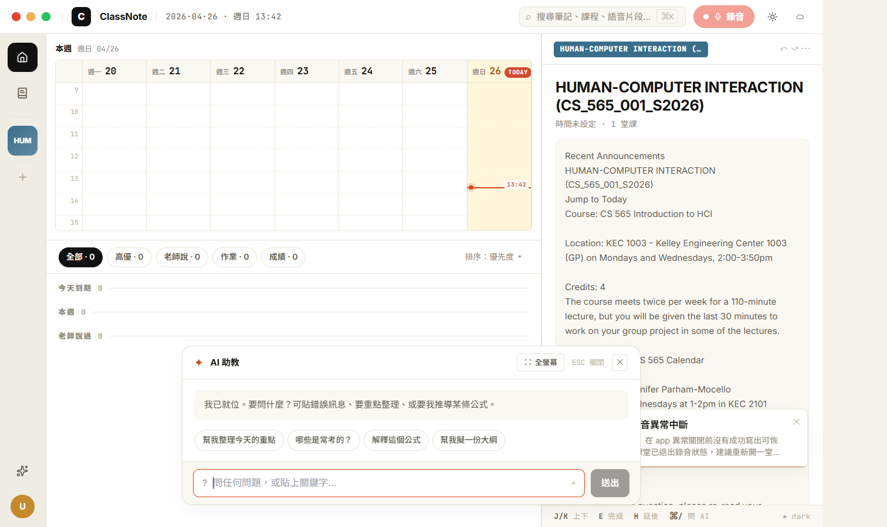
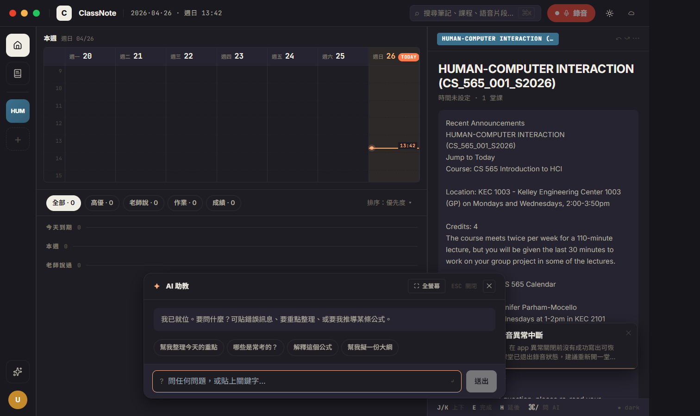
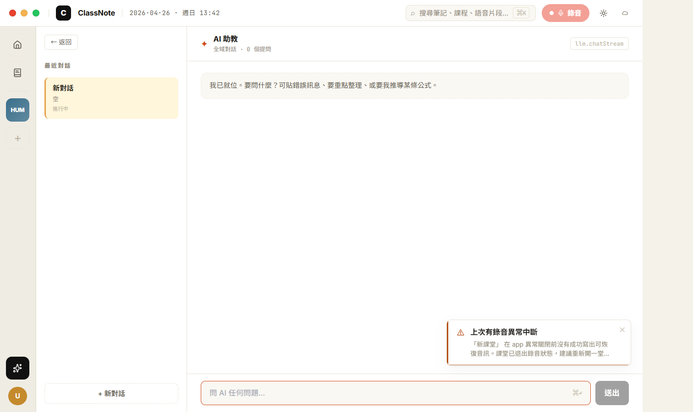
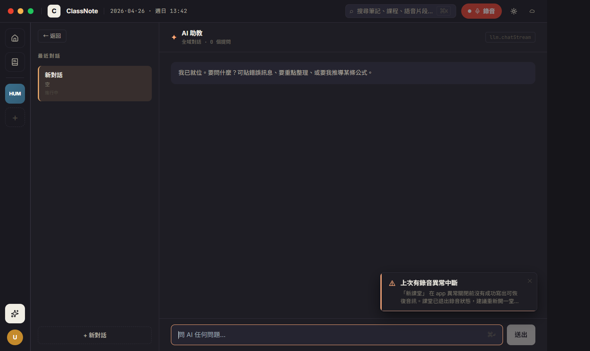

# CP-6.6 · Phase 6 真重寫 — H18 AIDock + AIPage (全域 AI 助教)

**狀態**：等你 visual review。
**規則**：UI 1:1 / backend wire / 沒做的留白。
**驗證**：`tsc --noEmit` clean、CDP 截圖 4 張 (dock light/dark + page light/dark)。
**Plan 對應**：`PHASE-6-PLAN.md` § 4 P6.6。

**分支**：`feat/h18-design-snapshot`

## P6.6 commits（這次）

```
feat(h18-cp66): AI 助教 — H18AIDock (⌘J 浮動) + H18AIPage (rail ✦ 全螢幕)
docs(h18): CP-6.6 walkthrough + screenshots
```

合一個 commit 推。

## 啟動

```bash
cd d:/ClassNoteAI-design/ClassNoteAI
npm run dev:ephemeral
```

⌘J（Ctrl+J on Win）→ 浮動 AIDock（任何頁面都可叫出）。
Rail ✦ AI 助教 → 全螢幕 H18AIPage。
Dock 上的「⛶ 全螢幕」按鈕 → 關 dock + 跳 AIPage。

兩者**共用 history**（`localStorage['h18-ai-history-v1']`），可以在 dock 開頭一個對話、之後在 page 接續。

## 視覺驗證 — 4 張截圖

> 在 `docs/design/h18-deep/checkpoints/screenshots/cp-6.6-*.png`。

### 1 · cp-6.6-aidock-light.png — ⌘J 浮動 dock



對應 `h18-aidock-recording.jsx` (AIDock)。

- [ ] **Dock**：bottom-center 620px 圓角卡片，h18-shadow + 200ms slide-up animation
- [ ] **Header**：✦ accent + AI 助教 + ⛶ 全螢幕 + ESC 關閉 mono kbd + ✕ close 22px 方鈕
- [ ] **Body** (intro 狀態)：dashed border 提示 "我已就位。要問什麼？可貼錯誤訊息..." + 4 個 quick question pills (幫我整理今天的重點 / 哪些是常考的？/ 解釋這個公式 / 幫我擬一份大綱)
- [ ] **Footer**：? 圖示 + input + ↵ kbd hint + 送出 invert button
- [ ] **背景半透**：底下 home 看得到 (calendar grid + HUMAN-COMPUTER INTERACTION preview content)，scrim 是 transparent — dock 點擊外部會關（onClose）

### 2 · cp-6.6-aidock-dark.png



- [ ] dock 切到 `#1e1d24` 暖暗 surface，accent ✦ 變更亮的橘 `#ffab7a`
- [ ] dashed-border intro hint 還是看得清楚
- [ ] quick question pills border 切到 dark border

### 3 · cp-6.6-aipage-light.png — rail ✦ 進全螢幕



對應 `h18-nav-pages.jsx` L604+ (AIPage)。

- [ ] **2-column grid** 260px sidebar | 1fr main，欄間 1px h18-border
- [ ] **Sidebar**：← 返回 button + 最近對話 mono caps + 「新對話」session card (active 黃 sel-bg + 3px sel-border 左邊條) + 「+ 新對話」dashed button bottom
- [ ] **Main head**：✦ accent + AI 助教 13px bold + 全域對話 · 0 個提問 mono sub + 右上 `llm.chatStream` mono pill 邊框
- [ ] **Body**：第一條訊息是 dashed-border "我已就位。要問什麼？..." hint
- [ ] **Footer**：input + ⌘↵ kbd + 送出 button (disabled until 有 input)
- [ ] Rail ✦ AI active highlight (cream invert)
- [ ] AI fab 在這頁 **隱藏**（per prototype，AIPage 自己就是 AI surface）

### 4 · cp-6.6-aipage-dark.png



- [ ] sidebar / main 全切 dark surface
- [ ] sel-bg 從 `#fff6db` → `rgba(240,175,110,0.12)` 半透橘
- [ ] active session 左邊條 `#e8a86a`（dark sel-border）

## 真接後端的部分

| 元件 | 接哪 |
|------|------|
| 對話 streaming | `llm.chatStream(messages)` AsyncGenerator (real LLM API) |
| History persist | `localStorage['h18-ai-history-v1']` (跨 dock + page 共用) |
| Session prompt | 內建 `SYSTEM_PROMPT`（繁中助教，回答簡潔） |

## 留白部分

- **Multi-session 切換** — 目前只有單一「目前對話」session。多 session list (HW3 怎麼做？/ 整理 ML L11-13/...) 沒接，有「+ 新對話」會 clear 當前。原因：chatSessionService 是 lecture-scoped（用在 AIChatPanel），全域 session 沒對應 schema。留 P6.x 加。
- **Lecture-scoped citations** (RAG bilink hover) — dock + page 都用全域 chatStream，沒接 RAG。lecture-scoped chat 仍用 legacy AIChatPanel（從 NotesView 觸發）。
- **Quick question pills 的 onClick** — 點了只是填到 input，不自動送出（避免使用者誤觸）
- **Citation pills (→ L13 · 38:14)** — 數據結構保留 (AIMsg.cites)，但沒實際渲染來源（要 RAG 拿 timestamp）
- **AIPage 沒有 `已讀取 ML L11-14` 的 context badge** — prototype 有，但實機沒辦法取「目前在看哪個 lecture」（dock 有 contextHint 從 activeNav 推，但 page 是全螢幕沒這 context）

## 改了什麼

```
新:
  src/components/h18/useAIHistory.ts                       · 共用 history hook + chatStream wrapper
  src/components/h18/H18AIDock.tsx                         · ⌘J 浮動小窗
  src/components/h18/H18AIDock.module.css
  src/components/h18/H18AIPage.tsx                         · 全螢幕 2-column AI 助教
  src/components/h18/H18AIPage.module.css
  docs/design/h18-deep/checkpoints/CP-6.6.md
  docs/design/h18-deep/checkpoints/screenshots/cp-6.6-*.png

改:
  src/components/h18/H18DeepApp.tsx                        ·
    · `ai` route 換 H18AIPage
    · 加 aiDockOpen state
    · ⌘J 改 toggle dock (而非跳 ai page)
    · ESC 多一層 (dock first)
    · ✦ AI fab onClick 改 setAiDockOpen(true) (取代跳 ai page)
    · contextHint 從 activeNav.kind === course/review/recording 推 course title
```

**Legacy 還在 disk**：`AIChatPanel.tsx` (lecture-scoped, NotesView 觸發) + `AIChatWindow.tsx` (detached webview)。它們還活著，因為 lecture-scoped RAG chat 暫時還沒有 H18 替代品。

## 已知 issue

1. **Dock 跟 Page 同 history 但 page 不會 live update dock 已存的訊息** — useAIHistory 只在 mount 時 load，兩個 instance 會走自己的 state。實際使用 dock 關掉再開，會重新 load。Page 跟 dock 不會同時開（aiDockOpen 跟 activeNav==='ai' 互斥），所以實務沒問題。
2. **session list 是寫死單一條** — 之前 cleanr 「+ 新對話」其實是清空 history，沒真 multi-session。
3. **Recovery toast 跟 AI fab/dock 視覺重疊** — toast 在 right-bottom 20+20，dock 也是 bottom-center，dock z=900 > toast z 應該會蓋過，但 toast 卡片較窄不影響閱讀。
4. **裡面顯示 "進行中"** — 即使沒在 stream 也是這字串。改成 stream 中才顯示就好。

## 下個 CP — P6.7 Settings + Profile

按 plan 順序，P6.7 = ProfilePage 8 sub-pane 重寫，TrashView 併進 PData。把 SettingsView / ProfileView / TrashView 全砍。

review 完點頭就推。
