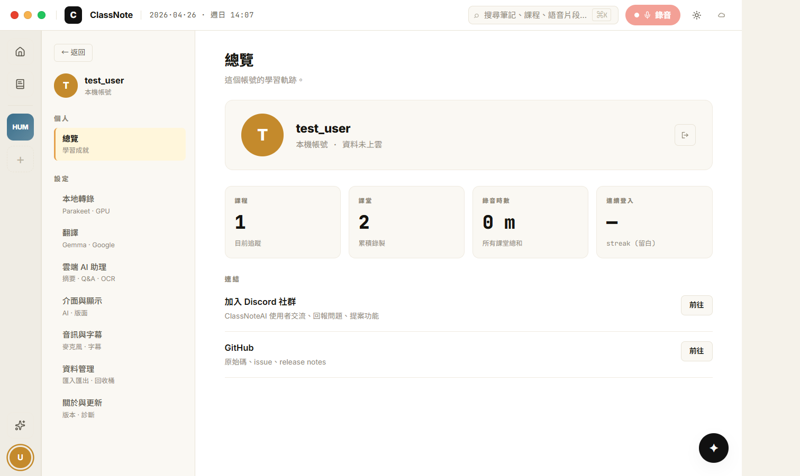
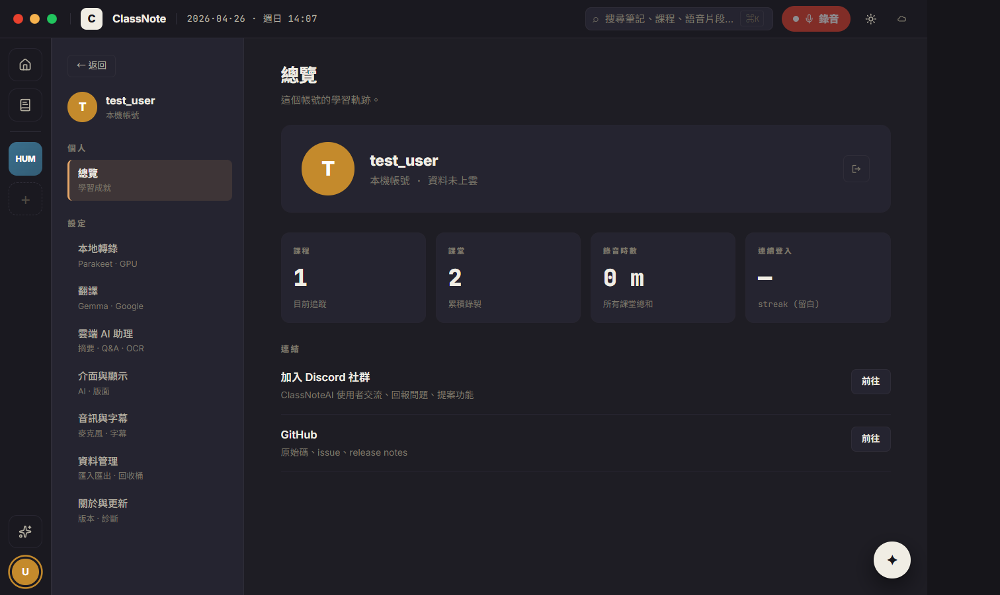
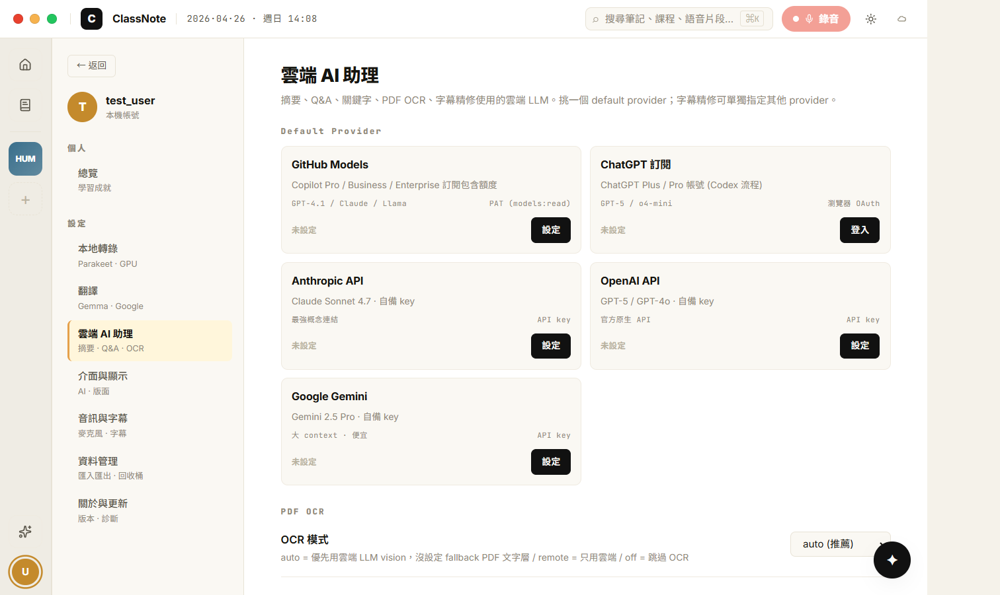
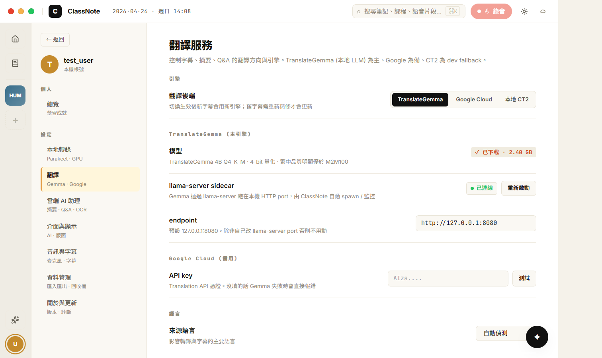
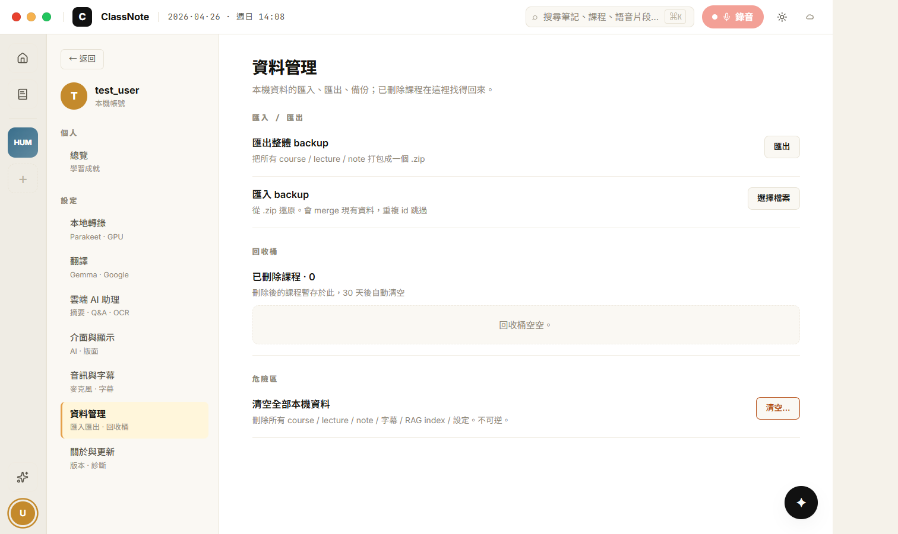
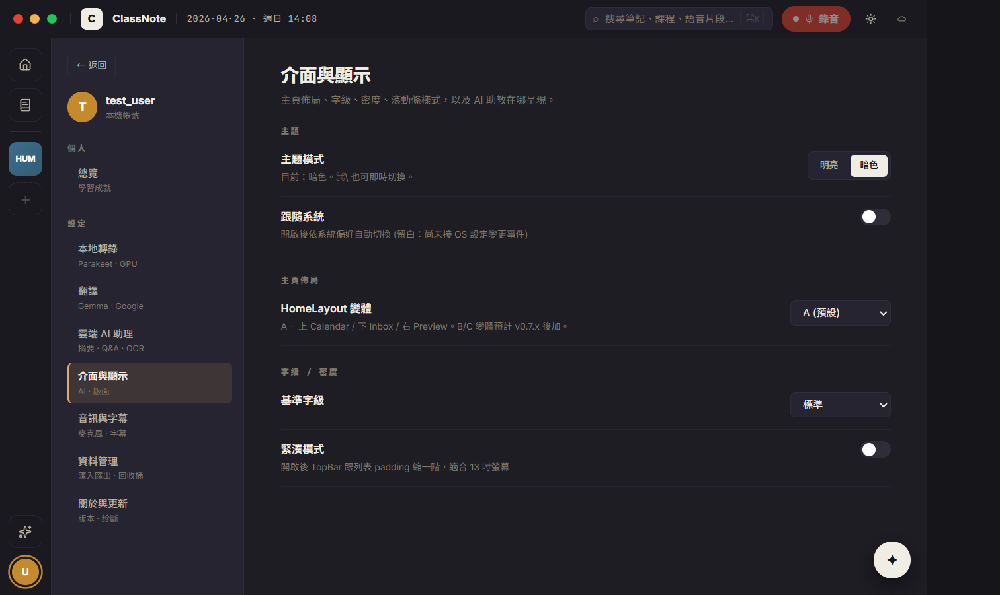
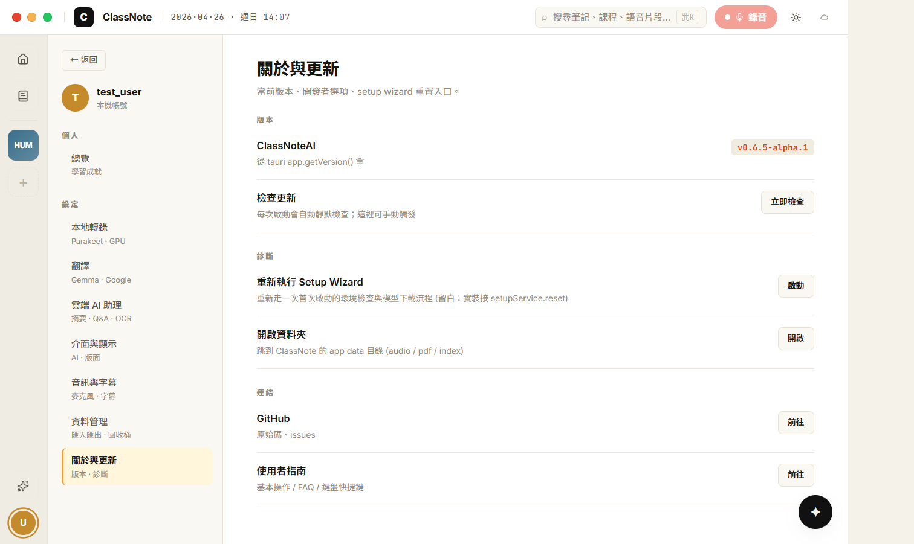

# CP-6.7 · Phase 6 真重寫 — ProfilePage 8 sub-pane (Settings + Trash 全併進來)

**狀態**：等你 visual review。
**規則**：UI 1:1 / backend wire when exists / 沒做的留白。本 CP UI 視覺優先，**多數控件 wiring 是 stub** —— 等下個「wiring audit」CP 統一接 storageService。
**驗證**：`tsc --noEmit` clean、CDP 截圖 7 張。
**Plan 對應**：`PHASE-6-PLAN.md` § 4 P6.7。

**分支**：`feat/h18-design-snapshot`

## 已 wire 的部分（real）

| 元件 | 接哪 |
|------|------|
| POverview 課程數 / 課堂數 / 錄音時數 | `storageService.listCourses()` + `listLectures()` (real) |
| POverview 用戶名 + initial | `useAuth().user.username` (real) |
| POverview 登出 | `useAuth().logout()` → 觸發 LoginScreen (real) |
| PAppearance 主題 toggle | `applyTheme` + `toggleTheme` from H18DeepApp (real) |
| PData 回收桶列表 | `invoke('list_trashed_courses')` + `storageService.restoreCourse` (real) |
| PAbout 版本 | `app.getVersion()` from `@tauri-apps/api/app` (real) |

## 留白的部分（stub）— 預計下個 wiring audit CP 收

- **PTranscribe**：所有控件（model select / GPU 偵測 / log level / 進階）都是 visual stub，沒寫到 storageService.appSettings
- **PTranslate**：除了 segmented control 的 local state，其它所有控件 stub
- **PCloud**：5 個 provider card 全 stub (no API key 寫入)，PDF OCR / 字幕精修 / 用量也 stub
- **PAudio**：麥克風 / 字幕字級 / 雙語 toggle 全 stub（audio device list 不接）
- **PData 匯入匯出**：button 沒接（沒對應後端命令）
- **PData 危險區**：「清空全部」沒接
- **PAbout 立即檢查更新**：沒接 updateService.checkForUpdates
- **PAbout 重新執行 Setup Wizard**：沒接 setupService.reset
- **PAbout 開啟資料夾**：沒接 openPath

詳細清單會 dump 到下個 CP 的 wiring audit 列表。

## P6.7 commits（這次）

```
feat(h18-cp67): ProfilePage — 8 sub-pane (Overview + Transcribe / Translate / Cloud / Appearance / Audio / Data / About)
docs(h18): CP-6.7 walkthrough + screenshots
```

合一個 commit 推。

## 啟動

```bash
cd d:/ClassNoteAI-design/ClassNoteAI
npm run dev:ephemeral
```

點 rail 👤 (avatar) → ProfilePage。Sidebar 切 8 個 tab。

## 視覺驗證 — 7 張截圖

> 在 `docs/design/h18-deep/checkpoints/screenshots/cp-6.7-*.png`。

### 1 · cp-6.7-overview-light.png — POverview default tab



對應 `h18-nav-pages.jsx` POverview L1248+。

- [ ] **Sidebar 230px** (h18-surface2)：← 返回 + T avatar (gold) + test_user / 本機帳號 + 個人 mono caps + 總覽 (active 黃 sel-bg + 3px sel-border) + 設定 mono caps + 7 settings tabs (本地轉錄 / 翻譯 / 雲端 AI 助理 / 介面與顯示 / 音訊與字幕 / 資料管理 / 關於與更新) 每 tab 帶 hint
- [ ] **Content**：總覽 22px bold + hint
- [ ] **Hero card** (12px round surface2)：64px T avatar 金 + test_user 18px + 「本機帳號 · 資料未上雲」 mono + 32px 登出 button (door icon)
- [ ] **4-stat grid** (28px mono digits)：課程 1 / 課堂 2 / 錄音時數 0m / 連續登入 — (留白)。**真資料**：1 課 2 lectures 是使用者真實狀態。
- [ ] **連結**：Discord + GitHub rows + 前往 buttons

### 2 · cp-6.7-overview-dark.png



- [ ] 大底切 dark surface
- [ ] sel-bg 切 半透橘
- [ ] hero card avatar 金色 + 文字反白

### 3 · cp-6.7-pcloud-light.png — 雲端 AI 助理（最複雜的 tab）



對應 `h18-nav-pages.jsx` PCloud L2314+。

- [ ] 5 個 provider card 自動 grid (auto-fit minmax 260)：GitHub Models / ChatGPT 訂閱 / Anthropic API / OpenAI API / Google Gemini
- [ ] 每個 card：名字 13px bold + 描述 11px + sub-feature mono caps + auth type mono caps + 狀態 mono + action button (設定 / 登入)
- [ ] PDF OCR 控件 select
- [ ] 字幕精修強度 + provider 覆寫 select
- [ ] 用量 4-grid (— 留白)

### 4 · cp-6.7-ptranslate-light.png — 翻譯



對應 `h18-nav-pages.jsx` PTranslate L2226+。

- [ ] 翻譯後端：3-button segmented (TranslateGemma active / Google Cloud / 本地 CT2)
- [ ] TranslateGemma 段：✓ 已下載 chip + llama-server 狀態 + endpoint input + GPU 提示
- [ ] Google Cloud：API key input + 測試 button
- [ ] 本地 CT2：legacy fallback 提示
- [ ] 語言：來源 / 目標 select + 雙語字幕 toggle

### 5 · cp-6.7-pdata-light.png — 資料管理 (含回收桶)



對應 `h18-nav-pages.jsx` PData (折 TrashView)。

- [ ] 匯入 / 匯出 section
- [ ] 回收桶 section：顯示真實 list_trashed_courses（**這次空，所以 dashed empty card「回收桶空空」**）
- [ ] 危險區：清空全部本機資料 hot-styled button

### 6 · cp-6.7-pappearance-dark.png — 介面與顯示 (dark mode)



對應 `h18-nav-pages.jsx` PAppearance。

- [ ] 主題 segmented control (明亮 / 暗色 active)
- [ ] 跟隨系統 toggle (off, 留白)
- [ ] 主頁佈局 select (A 預設, B/C 留白)
- [ ] 字級 / 緊湊模式 (留白)
- [ ] **真 wire**：點 segmented control 切 light/dark 即時生效 (用 H18DeepApp.toggleTheme)

### 7 · cp-6.7-pabout-light.png — 關於與更新



對應 `h18-nav-pages.jsx` PAbout。

- [ ] 版本 row：ClassNoteAI · `v0.6.5-alpha.1` chip (real, from `app.getVersion()`)
- [ ] 檢查更新 row + 立即檢查 button (留白)
- [ ] 診斷：重新執行 Setup Wizard + 開啟資料夾 (留白)
- [ ] 連結：GitHub / 使用者指南

## 改了什麼

```
新:
  src/components/h18/ProfilePage.tsx                       · shell + tab router
  src/components/h18/ProfilePage.module.css                · primitives + sub-pane styles
  src/components/h18/ProfilePanes.tsx                      · 8 sub-panes + shared primitives (PHeader / PHead / PRow / PSelect / PToggle / PBtn / PInput / PSeg)
  docs/design/h18-deep/checkpoints/CP-6.7.md
  docs/design/h18-deep/checkpoints/screenshots/cp-6.7-*.png

改:
  src/components/h18/H18DeepApp.tsx                        ·
    · `profile` route 換 ProfilePage (取代之前的 placeholder)
    · 移除 isLegacySettingsOpen / isTrashOpen state（legacy 入口拔了）
    · 移除 SettingsView / TrashView import
```

**Legacy 已不再被路由引用**：`SettingsView.tsx`、`ProfileView.tsx`、`TrashView.tsx`。但 disk 上還在，等下個 wiring audit CP 一次刪。

## POverview B/C/D 變體沒做（per plan Q4 lock = A）

只實作 A 變體（資訊密集）。B (編輯刊物) / C (書信體) / D (精煉) 等 v0.7.x 後再加。

## 下個 CP — 兩條路二選一

按 plan 順序，下個是 P6.8 Search ⌘K（minisearch global index）。但使用者說 *"做完 UI 之後再回來看哪些東西沒有串接起來"*，所以兩條路：

- **P6.8 Search** (continue UI marathon)：建 globalSearchService.ts (minisearch 包 listCourses + listLectures + RAG 摘要) + SearchOverlay 真做
- **CP-6.5+** (recording 真重寫)：拆 useRecordingSession hook + RV2 Layout A + RV2FinishingOverlay
- **CP-6.9** (NotesEditorPage)：optional knowledge base 頁

或

- **wiring audit CP**：把所有 stub 控件補上 storageService.saveAppSettings 寫入

按 user 指示「先做完 UI 再做 wiring」，我會先推 P6.8 + CP-6.5+，最後做 wiring audit。

review 完點頭就推 P6.8。
