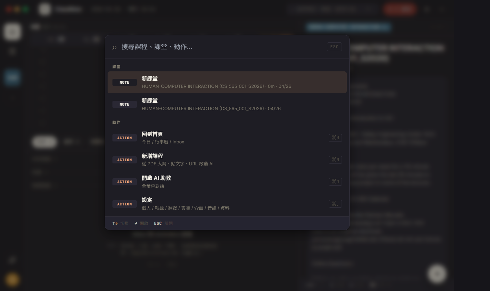
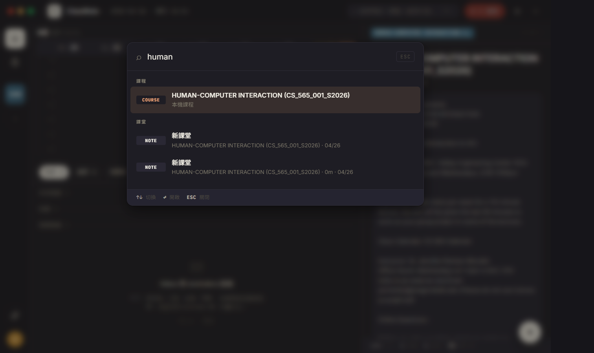
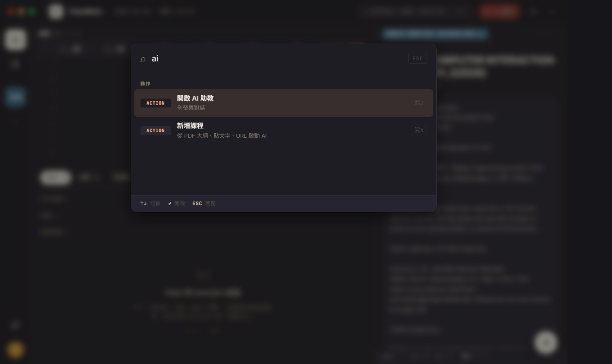
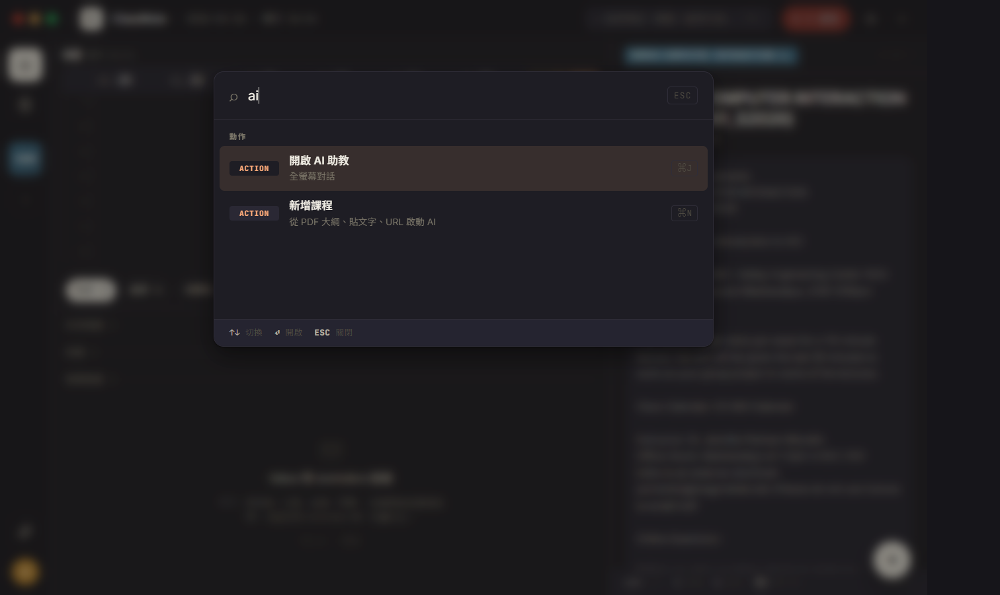

# CP-6.8 · Phase 6 真重寫 — ⌘K 全域搜尋 (minisearch)

**狀態**：等你 visual review。
**規則**：UI 1:1 / backend wire / 沒做的留白。
**驗證**：`tsc --noEmit` clean、CDP 截圖 4 張（empty / search "human" / search "ai" action / dark mode）。
**Plan 對應**：`PHASE-6-PLAN.md` § 4 P6.8。

**分支**：`feat/h18-design-snapshot`

## P6.8 commits（這次）

```
feat(h18-cp68): ⌘K 全域搜尋 — globalSearchService + SearchOverlay
docs(h18): CP-6.8 walkthrough + screenshots
```

合一個 commit 推。

## 啟動

```bash
cd d:/ClassNoteAI-design/ClassNoteAI
npm run dev:ephemeral
```

任何頁面按 ⌘K（Ctrl+K on Win） → SearchOverlay。
鍵盤 ↑↓ 切結果，↵ 開啟，ESC 關閉。

## 視覺驗證 — 4 張截圖

> 在 `docs/design/h18-deep/checkpoints/screenshots/cp-6.8-*.png`。

### 1 · cp-6.8-search-empty.png — empty query (recent + actions)



對應 `h18-nav-pages.jsx` SearchOverlay (L27+)。

- [ ] **scrim** 0.45 黑紗 + backdrop-blur，modal top 12vh 中對齊
- [ ] **Modal** 600px 圓角 12 + slide-down 200ms animation
- [ ] **Header**：⌕ icon + input placeholder「搜尋課程、課堂、動作…」+ ESC mono kbd 邊框
- [ ] **Empty 狀態**：顯示真實 NOTE rows (HUMAN-COMPUTER INTERACTION 課程的 lectures) + ACTION rows (回到首頁 ⌘H / 新增課程 ⌘N / 開啟 AI 助教 ⌘J / 設定 ⌘,)
- [ ] **Group head** mono caps：`課堂` / `動作`
- [ ] **Row** 60px kind chip + label + sub + 右側 shortcut。第一筆 highlight (sel-bg 黃)
- [ ] **Footer**：`↑↓ 切換` `↵ 開啟` `ESC 關閉` mono hints

### 2 · cp-6.8-search-human.png — 搜課程



- [ ] 輸入 `human` → minisearch fuzzy hit → 結果有：
  - **課程** group: `COURSE` row 「HUMAN-COMPUTER INTERACTION (CS_565_001_S2026) · 本機課程」
  - **課堂** group: 2 個 NOTE rows (HCI 下的 lectures)
- [ ] 第一筆 (COURSE row) auto-selected

### 3 · cp-6.8-search-ai-action.png — 搜動作



- [ ] 輸入 `ai` → 動作 group：
  - 開啟 AI 助教 (⌘J shortcut chip)
  - 新增課程 (⌘N shortcut, 因為 indexText 含 "新增 課程 add course new")
- [ ] keywords-based fuzzy match work (新增課程 不一定要 label 含 "ai")

### 4 · cp-6.8-search-dark.png — dark mode



- [ ] modal 切到 dark surface
- [ ] sel-bg 變半透橘
- [ ] kind chip background 從 chip-bg 切到 dark chip-bg

## 真接後端的部分

| 元件 | 接哪 |
|------|------|
| globalSearchService.build | `storageService.listCourses()` + `listLectures()` (real) |
| Index 重建觸發 | listen `classnote-courses-changed` event (從 H18DeepApp / CourseCreationDialog 觸發) |
| 搜尋引擎 | `MiniSearch` (npm minisearch v7.2)，prefix + fuzzy 0.18 + boost label 2x |
| 動作 dispatch | SearchOverlay onAction → H18DeepApp setActiveNav / setIsCourseDialogOpen |
| 鍵盤 | ↑↓ navigate, ↵ exec, ESC close, ⌘K toggle |

## 留白

- **概念 (concept) index** — 沒做 concept extraction，prototype 的「Attention / Transformer / Eigenvalue 概念」rows 不出現。下個 wiring audit CP 接 RAG store 摘要時可以一起加。
- **Reminder index** — 沒 reminders schema (per P6.2 留白)。prototype 有「作業 / 考試」group。
- **Search 結果即時 highlighting** — 沒做 query 文字 highlighting（fuzzy match 邊界不明顯）。Minimal.
- **跨 lecture 搜 transcript 全文** — index 只放 lecture title + course title + keywords，不索引 subtitle 全文（避免 index 爆掉）。要的話下個 CP 把 RAG store 的 lecture summary 摘要塞進 indexText。

## 改了什麼

```
新:
  src/services/globalSearchService.ts                      · minisearch index + build/search API
  src/components/h18/SearchOverlay.tsx                     · H18 styled ⌘K overlay
  src/components/h18/SearchOverlay.module.css
  docs/design/h18-deep/checkpoints/CP-6.8.md
  docs/design/h18-deep/checkpoints/screenshots/cp-6.8-*.png

改:
  src/components/h18/H18DeepApp.tsx                        ·
    · 移除 P6.1 的 stub overlay (.stubOverlay / .stubCard / .stubKbd)
    · 接 SearchOverlay component + onAction dispatcher (open-course /
      open-lecture / home / add-course / open-ai / open-settings)
```

## 已知 issue

1. **同一 query 重複搜兩次**：useEffect 依賴 `[open, query]`，open 變 true 跟 query 重設都會 re-fire。實務 OK (fast)。
2. **Index 不主動 prefetch**：第一次 ⌘K 才 build，可能延遲 ~100ms。後續 instant。
3. **Fuzzy 距離 0.18** 對中文不見得理想；英文夠用。等收 wiring audit 時 finetune。
4. **shortcut chip ⌘N / ⌘J / ⌘H / ⌘,** 顯示但**只有 ⌘K / ⌘\\ / ⌘J 真實際 wired**。⌘N / ⌘H / ⌘, 沒接（要在 H18DeepApp 加 keyboard listener）。

## 下個 CP

按 user 指示「先把 UI 做完再回頭看 wiring」，剩下：

- **CP-6.9**（optional）NotesEditorPage（▤ 知識庫 rail entry）— 跨課筆記 / canvas / split / LaTeX。新 feature scope
- **CP-6.5+**（compact）真 RV2 Recording layout — 拆 useRecordingSession hook
- **wiring audit CP** — 把 P6.7 settings stubs + ⌘N/⌘H/⌘, 等收齊

User 之前 lock Q5「NotesEditor 頁面要做」，所以下個是 CP-6.9。然後 CP-6.5+，最後 wiring audit。

review 完點頭就推 CP-6.9。
