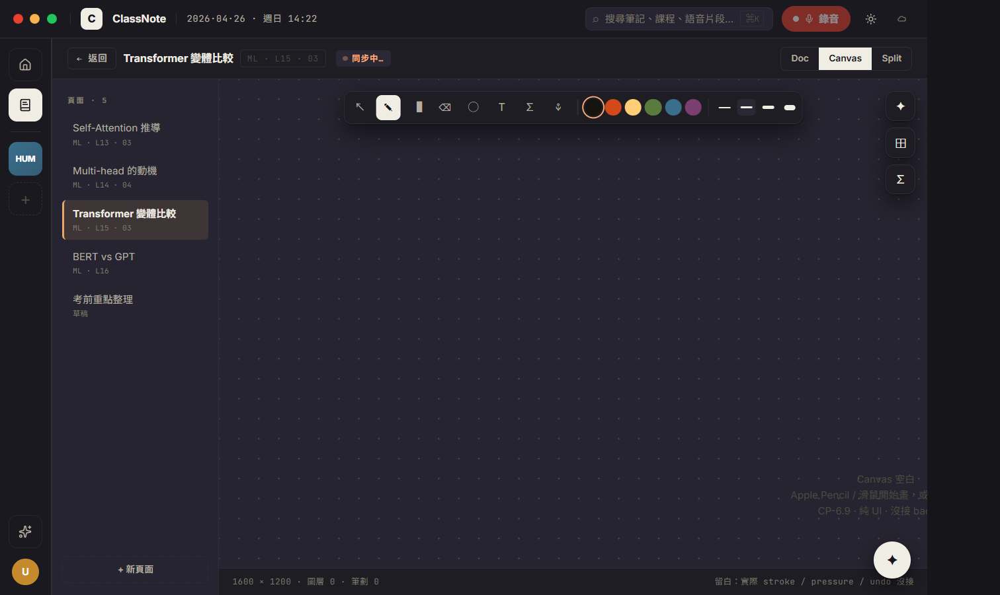
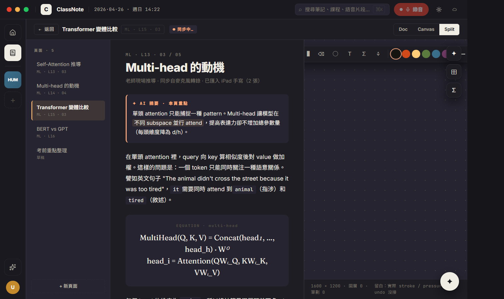
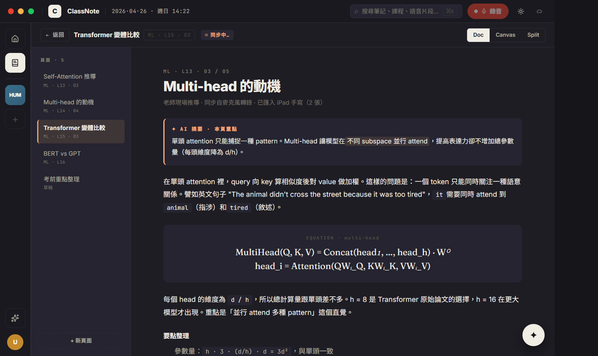

# CP-6.9 · Phase 6 真重寫 — NotesEditorPage (▤ 知識庫 · UI only)

**狀態**：等你 visual review。
**規則**：UI 1:1 / backend wire / 沒做的留白。Per user Q5 lock：「**頁面要做、功能不接 backend**」 → 純展示 H18 視覺，stroke / persistence / LaTeX render / iPad mirror **全部留白**。
**驗證**：`tsc --noEmit` clean、CDP 截圖 4 張 (doc light/dark + canvas + split)。
**Plan 對應**：`PHASE-6-PLAN.md` § 4 P6.9。

**分支**：`feat/h18-design-snapshot`

## P6.9 commits（這次）

```
feat(h18-cp69): NotesEditorPage — doc / canvas / split (UI only)
docs(h18): CP-6.9 walkthrough + screenshots
```

合一個 commit。

## 啟動

```bash
cd d:/ClassNoteAI-design/ClassNoteAI
npm run dev:ephemeral
```

點 rail 左側 **▤ 知識庫** → NotesEditorPage。
頂部 Doc / Canvas / Split toggle 切視圖。

## 視覺驗證 — 4 張截圖

> 在 `docs/design/h18-deep/checkpoints/screenshots/cp-6.9-*.png`。

### 1 · cp-6.9-doc-light.png — Doc 模式


對應 `h18-notes-editor.jsx` NotesEditorPage + NEDocPane (L321+)。

- [ ] **Top bar**：← 返回 + 文件標題 (Transformer 變體比較) + mono context pill (ML · L15 · 03) + 同步 pill (✦ accent + pulse dot) + Doc(active)/Canvas/Split segmented
- [ ] **Sidebar 200px** (h18-surface2)：`頁面 · 5` mono caps + 5 個 page item (Self-Attention 推導 / Multi-head 的動機 / Transformer 變體比較 active / BERT vs GPT / 考前重點整理) + 「+ 新頁面」dashed button
- [ ] **Doc pane**：max-width 720 居中，ML · L13 · 03 / 05 mono context + 「Multi-head 的動機」28px H1 + sub + accent-border AI 摘要 card + paragraph (with `code` blocks)
- [ ] **Equation box**：serif italic 「MultiHead(Q, K, V) = Concat(head₁, …, head_h) · Wᴼ / head_i = Attention(QWᵢ_Q, ...)」 (KaTeX 留白 — 用 serif italic 模擬)
- [ ] **要點整理** list + **錄音 callout** (▸ icon + 26:14 mono + quote + ▸ 聽 button)

### 2 · cp-6.9-canvas-light.png — Canvas 模式



對應 `h18-notes-editor.jsx` NECanvasPane (L399+)。

- [ ] **Top center toolbar** (sticky、shadow): 8 tools (↖ 選取 / ✎ 筆 / ▐ 螢光 / ⌫ 橡皮 / ◯ 圖形 / T 文字 / ∑ 公式 / ⚘ 圖) + divider + 6 colors + divider + 4 stroke weights
- [ ] **Pen tool active** (invert 黑底白字)，紫色 active color (rim ring)，weight 2.5 active (chip-bg)
- [ ] **Top right fabs**：✦ AI / ⊞ iPad mirror / ∑ OCR
- [ ] **Canvas area**：dot grid 24px pattern，中央 empty hint `Canvas 空白 / Apple Pencil ... / CP-6.9 · 純 UI · 沒接 backend`
- [ ] **Footer status bar**：1600 × 1200 · 圖層 0 · 筆劃 0 + 留白 hint

### 3 · cp-6.9-split-light.png — Split 模式



- [ ] **2-column** doc 1fr | canvas 1fr，欄間 1px 分割線
- [ ] doc pane padding 縮成 28x36（split 模式減量）
- [ ] canvas toolbar 還是 sticky top-center，但縮在右半邊範圍內

### 4 · cp-6.9-doc-dark.png — dark mode



- [ ] 整片 dark surface
- [ ] AI 摘要 card 邊框依舊 accent (亮橘 `#ffab7a`)
- [ ] equation box 的 serif italic 在暗底依舊可讀
- [ ] 錄音 callout 依舊明顯

## 真接後端的部分

無。Per Q5 lock，整片 UI-only。

## 留白部分（per Q5）

- **頁面持久化**：sidebar 5 個頁面是 mock，沒寫到任何 schema (還沒設計 notebook table)
- **Doc 編輯**：doc pane 是 read-only 渲染，沒 markdown editor，沒寫入
- **Canvas 筆畫**：toolbar / colors / weights 都是 visual state，沒 stroke recording, 沒 SVG output, 沒 undo
- **LaTeX render**：用 serif italic 假裝；KaTeX integration 留 v0.7.x
- **iPad mirror**：toolbar fab `⊞` 沒功能，floating mirror window 沒做
- **OCR → LaTeX**：toolbar fab `∑` 沒接（後端有 PDF OCR 但這條 path 不存在）
- **Apple Pencil 壓感**：沒做
- **同步 pill**：純 cosmetic 動畫，3.2s 循環 drawing → syncing → synced

## 改了什麼

```
新:
  src/components/h18/NotesEditorPage.tsx                   · doc / canvas / split shell
  src/components/h18/NotesEditorPage.module.css
  docs/design/h18-deep/checkpoints/CP-6.9.md
  docs/design/h18-deep/checkpoints/screenshots/cp-6.9-*.png

改:
  src/components/h18/H18DeepApp.tsx                        ·
    · `notes` route 換 NotesEditorPage (取代 placeholder)
    · 拔掉 unused Placeholder helper component (every nav target now real)
```

## 已知 issue

1. **「+ 新頁面」沒功能** — 預期。Q5 lock = UI only。
2. **Page item 切換只切 active state，doc 內容不變** — 預期。doc pane 是寫死 mock。
3. **Canvas mode 顯示「圖層 0 · 筆劃 0」** — 因為沒實際畫圖能力。
4. **Doc 看起來像靜態文章** — 對的。是 read-only mock，不是編輯器。
5. **Sync pill 永遠在循環** — 純 cosmetic，不反映實際狀態。

## 下個 CP 候選

按 user 指示「先做完 UI 再 wiring」，剩下：

- **CP-6.5+**（compact）真 RV2 Recording layout — 拆 useRecordingSession hook
- **wiring audit CP** — 把 P6.7 settings stubs + ⌘N/⌘H/⌘, 等收齊

UI 大架構基本上做完了：
- [x] P6.1 Chrome
- [x] P6.2 Home
- [x] P6.3 Course
- [x] P6.4 Review
- [x] P6.5 Recording (chrome wrap)
- [x] P6.6 AI
- [x] P6.7 Settings
- [x] P6.8 Search ⌘K
- [x] P6.9 Notes (UI only)

剩下 P6.5+ 補完 RV2 layout，然後 wiring audit。

review 完點頭就推 P6.5+。
